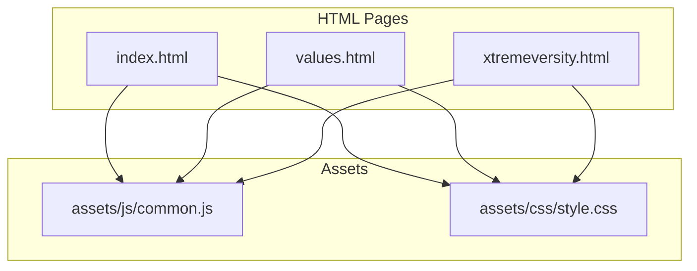
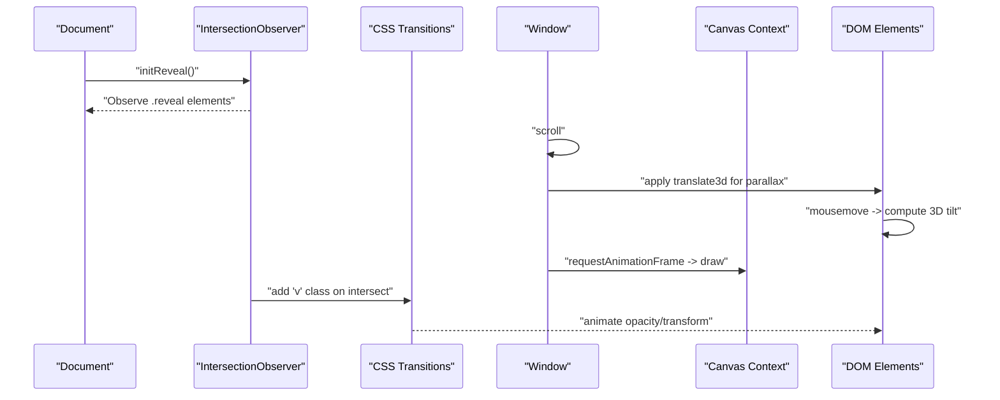
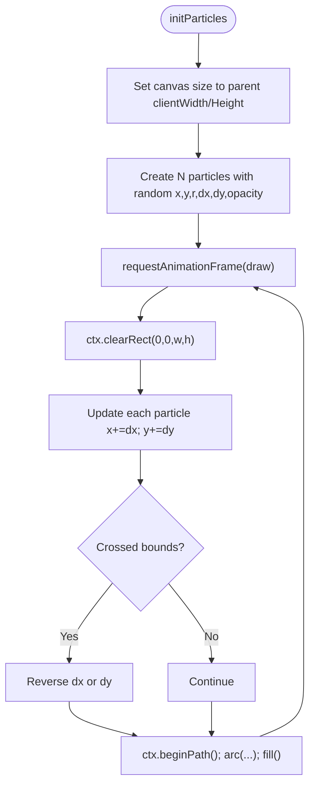
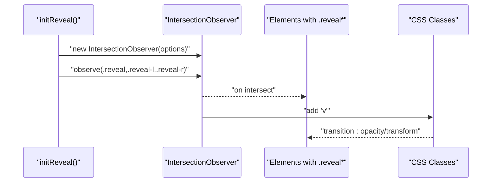
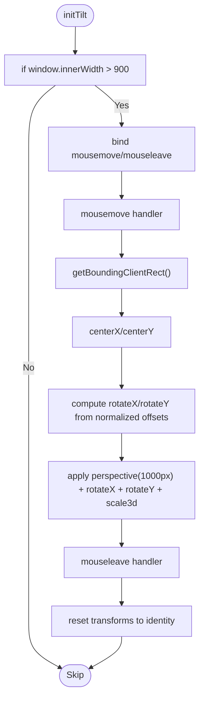
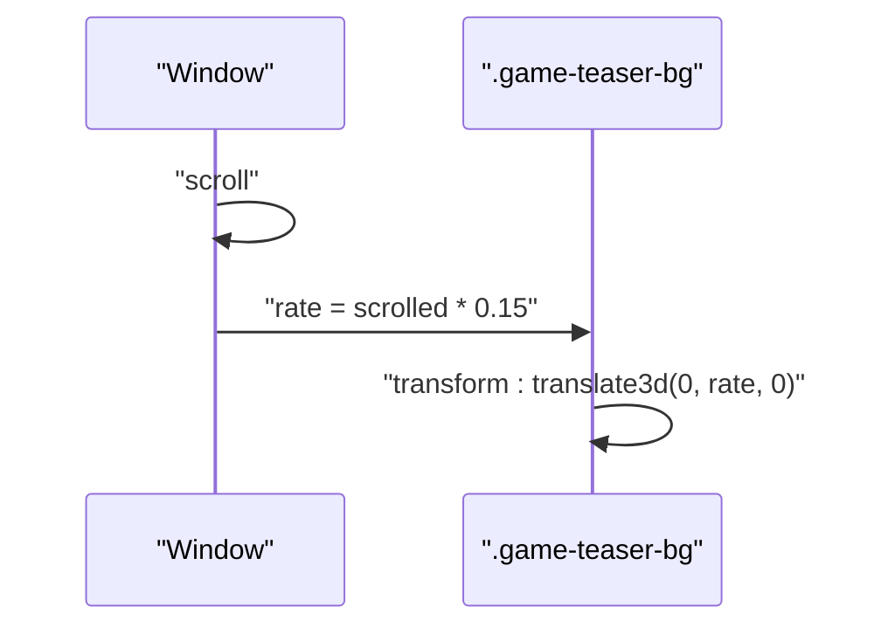
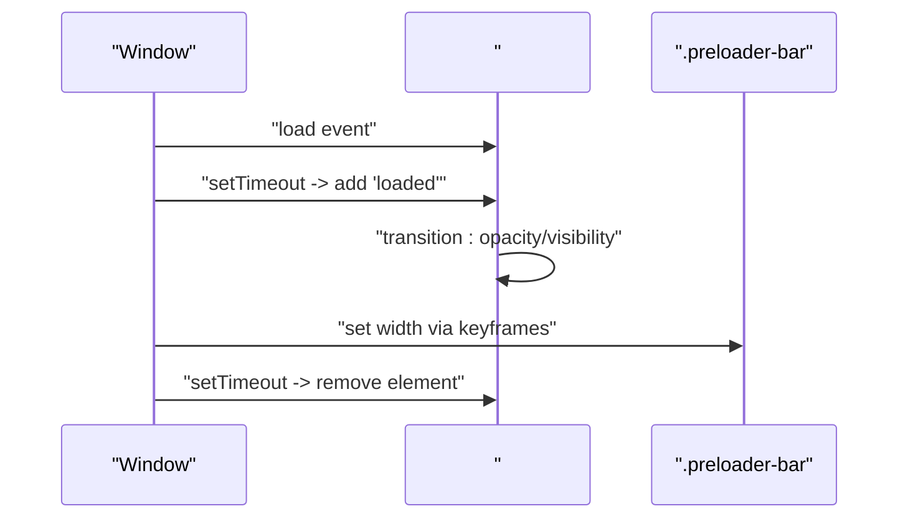
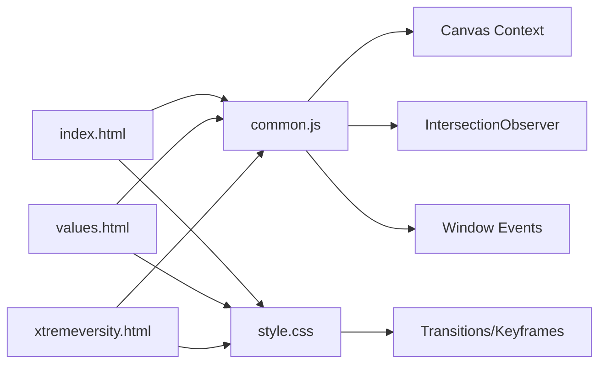

# Animation System

<cite>
**Referenced Files in This Document**
- [common.js](file://assets/js/common.js)
- [style.css](file://assets/css/style.css)
- [index.html](file://index.html)
- [values.html](file://values.html)
- [xtremeversity.html](file://xtremeversity.html)
- [README.md](file://README.md)
</cite>

## Table of Contents
1. [Introduction](#introduction)
2. [Project Structure](#project-structure)
3. [Core Components](#core-components)
4. [Architecture Overview](#architecture-overview)
5. [Detailed Component Analysis](#detailed-component-analysis)
6. [Dependency Analysis](#dependency-analysis)
7. [Performance Considerations](#performance-considerations)
8. [Troubleshooting Guide](#troubleshooting-guide)
9. [Conclusion](#conclusion)

## Introduction
This document explains the animation system powering the Mimi Games website. It covers:
- A Canvas-based particle background with generation, movement, boundary handling, and performance considerations
- Scroll-reveal animations using the Intersection Observer API to trigger CSS transitions
- 3D hover effects leveraging perspective transforms and mouse tracking calculations
- Parallax scrolling for background layers
- A preloader with progress indicators and timing controls
- Configuration options for timing, easing, and responsive behavior
- Performance guidelines and troubleshooting strategies

## Project Structure
The animation system spans a small set of files:
- JavaScript: animation initialization and event handlers
- CSS: keyframes, transitions, and responsive breakpoints
- HTML: markup that integrates animations and provides hooks for observers and transforms

**Diagram sources**
- [index.html](file://index.html)
- [values.html](file://values.html)
- [xtremeversity.html](file://xtremeversity.html)
- [common.js](file://assets/js/common.js)
- [style.css](file://assets/css/style.css)

**Section sources**
- [README.md](file://README.md)
- [index.html](file://index.html)
- [values.html](file://values.html)
- [xtremeversity.html](file://xtremeversity.html)
- [common.js](file://assets/js/common.js)
- [style.css](file://assets/css/style.css)

## Core Components
- Canvas particle background: generates a set of animated circles, updates positions each frame, and bounces off edges
- Scroll-reveal animations: Intersection Observer triggers CSS transitions on elements as they enter viewport
- 3D hover tilt effect: mousemove computes rotation around X/Y axes and scales for depth perception
- Parallax scrolling: scroll-driven translation on background layers
- Preloader: CSS transitions and a loader bar animate during page load

**Section sources**
- [common.js](file://assets/js/common.js)
- [style.css](file://assets/css/style.css)
- [index.html](file://index.html)

## Architecture Overview
The animation pipeline is event-driven and CSS-centric:
- DOM-ready and load events initialize observers and canvases
- Scroll events update transforms for parallax
- Mousemove updates transforms for 3D tilt
- Intersection Observer toggles CSS classes to trigger transitions
- CSS keyframes and transitions define motion and easing

**Diagram sources**
- [common.js](file://assets/js/common.js)
- [style.css](file://assets/css/style.css)

## Detailed Component Analysis

### Canvas Particle Background
- Initialization
  - Attaches to a canvas element inside the hero section
  - Resizes canvas to match parent container on load and resize
  - Creates a fixed number of particles with random positions, radii, velocities, and opacities
- Movement and rendering
  - Updates each particle’s x/y by dx/dy
  - Reverses velocity when crossing canvas boundaries
  - Clears and redraws all particles each frame using requestAnimationFrame
- Performance characteristics
  - Single-pass drawing per frame
  - Minimal per-pixel operations
  - Hardware-accelerated canvas rendering

**Diagram sources**
- [common.js](file://assets/js/common.js)

**Section sources**
- [common.js](file://assets/js/common.js)
- [index.html](file://index.html)

### Scroll Reveal Animations
- Trigger mechanism
  - Uses Intersection Observer with a small threshold and negative root margin
  - Observes elements with classes .reveal, .reveal-l, .reveal-r
  - Adds a class “v” when elements intersect, then stops observing them
- CSS transitions
  - Defines opacity and transform transitions for reveal classes
  - Left/right variants use translateX; vertical variant uses translateY
- Timing and easing
  - Transition durations and easing are defined in CSS keyframes and transitions

**Diagram sources**
- [common.js](file://assets/js/common.js)
- [style.css](file://assets/css/style.css)

**Section sources**
- [common.js](file://assets/js/common.js)
- [style.css](file://assets/css/style.css)
- [index.html](file://index.html)
- [values.html](file://values.html)
- [xtremeversity.html](file://xtremeversity.html)

### 3D Hover Effects (Perspective Tilt)
- Activation
  - Initializes only on larger viewports to avoid mobile overhead
  - Listens to mousemove and mouseleave on cards with classes .g-card, .feature-card, .social-big
- Calculation
  - Computes normalized offsets relative to card center
  - Maps normalized offsets to rotation degrees around X and Y axes
  - Applies perspective and scale3d for depth perception
- Reset
  - On mouseleave, resets transforms to identity

**Diagram sources**
- [common.js](file://assets/js/common.js)

**Section sources**
- [common.js](file://assets/js/common.js)
- [style.css](file://assets/css/style.css)

### Parallax Scrolling
- Trigger
  - Listens to scroll events
- Calculation
  - Reads pageYOffset and applies a small fraction of scroll distance to background layers
  - Uses translate3d for GPU-accelerated movement
- Target elements
  - Applies to elements with class .game-teaser-bg

**Diagram sources**
- [common.js](file://assets/js/common.js)

**Section sources**
- [common.js](file://assets/js/common.js)
- [style.css](file://assets/css/style.css)
- [index.html](file://index.html)
- [xtremeversity.html](file://xtremeversity.html)

### Preloader Animation and Progress Indicators
- Lifecycle
  - On window load, adds a class to fade out the preloader
  - Removes the preloader element after a short delay
- Visuals
  - Centered logo with a subtle pulse animation
  - Horizontal progress bar with gradient and animated width
  - CSS transitions control opacity and visibility

**Diagram sources**
- [common.js](file://assets/js/common.js)
- [style.css](file://assets/css/style.css)
- [index.html](file://index.html)

**Section sources**
- [common.js](file://assets/js/common.js)
- [style.css](file://assets/css/style.css)
- [index.html](file://index.html)

## Dependency Analysis
- HTML pages depend on shared assets:
  - common.js initializes observers, canvases, and transforms
  - style.css defines keyframes, transitions, and responsive behavior
- Interactions:
  - Scroll events drive parallax
  - Mousemove events drive 3D tilt
  - Intersection Observer toggles reveal classes
  - Canvas animation loop runs independently via requestAnimationFrame

**Diagram sources**
- [index.html](file://index.html)
- [values.html](file://values.html)
- [xtremeversity.html](file://xtremeversity.html)
- [common.js](file://assets/js/common.js)
- [style.css](file://assets/css/style.css)

**Section sources**
- [common.js](file://assets/js/common.js)
- [style.css](file://assets/css/style.css)
- [index.html](file://index.html)
- [values.html](file://values.html)
- [xtremeversity.html](file://xtremeversity.html)

## Performance Considerations
- Hardware acceleration
  - Use translate3d for parallax and 3D transforms to leverage GPU
  - Canvas rendering is GPU-accelerated by default
- Event throttling and selective activation
  - 3D tilt is disabled below a viewport threshold to reduce CPU usage
  - Intersection Observer reduces layout thrashing by batching animations
- Frame budget
  - requestAnimationFrame ensures smooth 60fps updates
  - Keep particle count moderate; adjust radius and opacity to balance aesthetics and performance
- CSS transitions
  - Prefer transform and opacity for GPU-friendly animations
  - Avoid layout-affecting properties in transitions
- Responsive behavior
  - Adjust timing and easing for different screen sizes via media queries
  - Reduce motion on lower-powered devices by simplifying animations

[No sources needed since this section provides general guidance]

## Troubleshooting Guide
- Particles not visible or moving
  - Ensure the canvas element exists and is appended to the DOM before initialization
  - Verify the canvas parent has non-zero dimensions
  - Confirm requestAnimationFrame is running and draw loop is invoked
- Scroll reveal not triggering
  - Check that elements have the correct classes (.reveal, .reveal-l, .reveal-r)
  - Validate Intersection Observer thresholds and root margins
  - Ensure elements are not hidden or clipped by overflow
- 3D tilt not responding
  - Confirm the viewport width check allows activation
  - Verify mousemove events are bound to the intended elements
  - Ensure transforms are not overridden by other styles
- Parallax not smooth
  - Confirm translate3d is applied and not overridden by transform properties
  - Reduce the scroll multiplier if motion feels too fast
- Preloader does not disappear
  - Check that the loaded class is added and CSS transitions are applied
  - Ensure the removal timeout is not blocked by long-running tasks

**Section sources**
- [common.js](file://assets/js/common.js)
- [style.css](file://assets/css/style.css)
- [index.html](file://index.html)

## Conclusion
The Mimi Games website’s animation system combines lightweight, efficient techniques:
- A Canvas particle background with minimal per-frame work
- Intersection Observer-driven scroll reveals for progressive enhancement
- 3D hover tilt with perspective transforms for depth
- Translate3d-based parallax for smooth motion
- A preloader with CSS transitions and a progress bar

These components are modular, configurable via CSS, and optimized for performance across devices. By adjusting timing, easing, and viewport thresholds, teams can tailor the animations to brand goals and device capabilities.