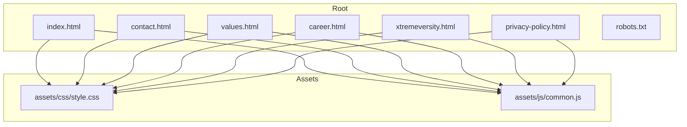
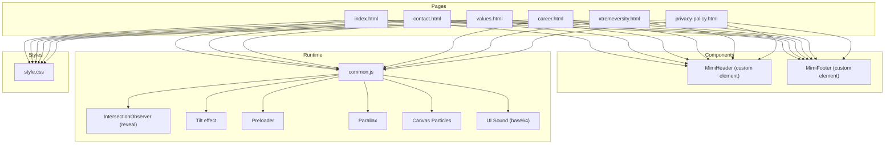
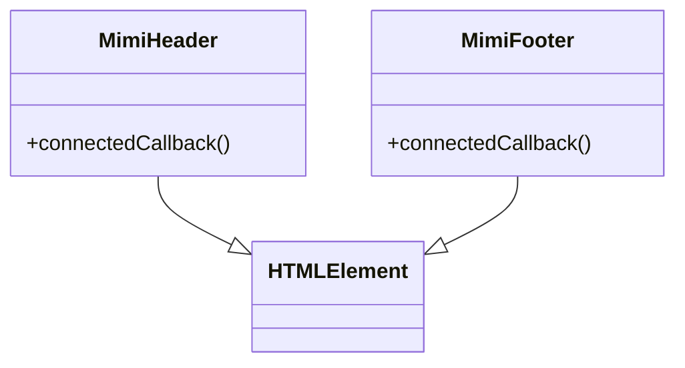
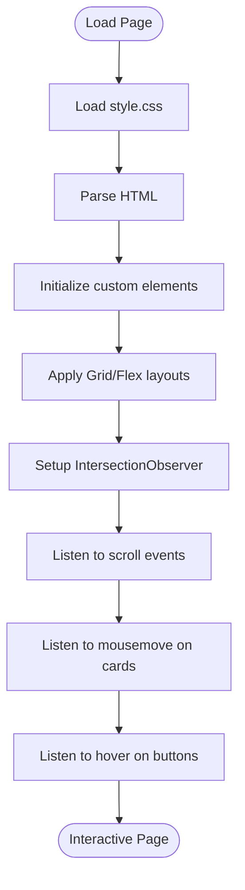
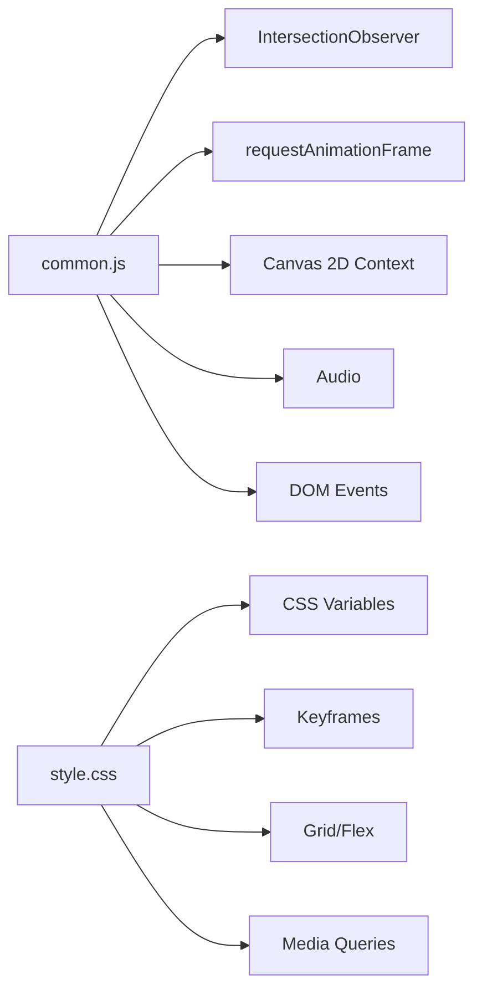

# Architecture Overview

<cite>
**Referenced Files in This Document**
- [README.md](file://README.md)
- [index.html](file://index.html)
- [contact.html](file://contact.html)
- [values.html](file://values.html)
- [career.html](file://career.html)
- [xtremeversity.html](file://xtremeversity.html)
- [privacy-policy.html](file://privacy-policy.html)
- [robots.txt](file://robots.txt)
- [assets/css/style.css](file://assets/css/style.css)
- [assets/js/common.js](file://assets/js/common.js)
</cite>

## Table of Contents
1. [Introduction](#introduction)
2. [Project Structure](#project-structure)
3. [Core Components](#core-components)
4. [Architecture Overview](#architecture-overview)
5. [Detailed Component Analysis](#detailed-component-analysis)
6. [Dependency Analysis](#dependency-analysis)
7. [Performance Considerations](#performance-considerations)
8. [Troubleshooting Guide](#troubleshooting-guide)
9. [Conclusion](#conclusion)
10. [Appendices](#appendices)

## Introduction
This document presents the architecture of the Mimi Games website, focusing on its component-based design using Web Components, animation systems, responsive layout strategies, performance optimizations, and asset management. The site is a static, multi-page application hosted on GitHub Pages with a custom domain. It emphasizes a cohesive brand identity, smooth user interactions, and scalable page composition through reusable header and footer components.

## Project Structure
The project follows a minimal, static structure with a shared stylesheet and a single shared JavaScript module that defines custom elements and runtime behaviors. Each page is self-contained and imports the shared styles and scripts.



**Diagram sources**
- [index.html](file://index.html)
- [contact.html](file://contact.html)
- [values.html](file://values.html)
- [career.html](file://career.html)
- [xtremeversity.html](file://xtremeversity.html)
- [privacy-policy.html](file://privacy-policy.html)
- [robots.txt](file://robots.txt)
- [assets/css/style.css](file://assets/css/style.css)
- [assets/js/common.js](file://assets/js/common.js)

**Section sources**
- [README.md](file://README.md)
- [index.html](file://index.html)
- [assets/css/style.css](file://assets/css/style.css)
- [assets/js/common.js](file://assets/js/common.js)

## Core Components
The site relies on two custom elements that encapsulate navigation and footer logic, enabling consistent UI across pages with minimal duplication.

- MimiHeader: Provides the navbar with logo, navigation links, and a mobile hamburger menu toggle. It sets the active link based on the current page and manages the mobile menu state.
- MimiFooter: Provides the footer with columns, an accordion-style mobile menu, social icons, and a back-to-top button.

These components are registered once and used across all pages via HTML tags.

**Section sources**
- [assets/js/common.js](file://assets/js/common.js)
- [index.html](file://index.html)
- [contact.html](file://contact.html)
- [values.html](file://values.html)
- [career.html](file://career.html)
- [xtremeversity.html](file://xtremeversity.html)
- [privacy-policy.html](file://privacy-policy.html)

## Architecture Overview
The architecture is component-centric and event-driven:

- Component Layer: Custom elements define the header and footer UI and behavior.
- Behavior Layer: Shared JavaScript initializes UI interactions, animations, and performance features.
- Presentation Layer: CSS defines themes, animations, responsive layouts, and visual effects.
- Asset Layer: Images, fonts, and embedded audio resources are referenced from the assets directory.



**Diagram sources**
- [assets/js/common.js](file://assets/js/common.js)
- [assets/css/style.css](file://assets/css/style.css)
- [index.html](file://index.html)
- [contact.html](file://contact.html)
- [values.html](file://values.html)
- [career.html](file://career.html)
- [xtremeversity.html](file://xtremeversity.html)
- [privacy-policy.html](file://privacy-policy.html)

## Detailed Component Analysis

### Custom Elements Pattern (Web Components)
- Registration: The custom elements are defined and registered once in the shared script.
- Lifecycle: The connectedCallback method constructs the DOM for the component and attaches event listeners.
- Encapsulation: Styles and behavior are scoped to the component, reducing cross-page coupling.
- Navigation State: The header sets an active class on the current page link based on the URL.



**Diagram sources**
- [assets/js/common.js](file://assets/js/common.js)

**Section sources**
- [assets/js/common.js](file://assets/js/common.js)

### Animation System Architecture
The site implements several animation subsystems orchestrated by the shared script:

- Scroll Reveal: Uses IntersectionObserver to add reveal classes when elements enter the viewport.
- Preloader: Fades out a splash screen after load.
- Parallax: Applies a transform to background elements during scroll.
- 3D Hover Tilt: Computes mouse position relative to card bounds to apply perspective and rotation transforms.
- Canvas Particle Background: Dynamically draws particles on a canvas sized to its container.
- UI Sound Feedback: Plays a base64-encoded audio clip on hover for interactive elements.

```mermaid
sequenceDiagram
participant Doc as "Document"
participant IO as "IntersectionObserver"
participant Page as "Page Content"
participant Tilt as "Tilt Handler"
participant Par as "Parallax Handler"
participant Part as "Particle Canvas"
participant Sound as "UI Audio"
Doc->>IO : observe(.reveal elements)
IO-->>Doc : trigger on intersection
Doc->>Page : add "v" class to intersected elements
Doc->>Par : scroll event
Par->>Par : compute scrolled distance
Par->>Page : apply translate3d to .game-teaser-bg
Doc->>Tilt : mousemove on .g-card
Tilt->>Tilt : compute normalized coordinates
Tilt->>Page : apply perspective + rotateX + rotateY + scale3d
Doc->>Part : load event
Part->>Part : resize canvas to container
Part->>Part : animate particles (requestAnimationFrame)
Doc->>Sound : hover on buttons
Sound->>Sound : play base64 audio
```

**Diagram sources**
- [assets/js/common.js](file://assets/js/common.js)

**Section sources**
- [assets/js/common.js](file://assets/js/common.js)

### Responsive Design Approach
The site employs a mobile-first, CSS Grid and Flexbox strategy:

- Typography and Layout: Root variables and clamp-based sizing ensure readable scaling across breakpoints.
- Grid and Flex: Sections use CSS Grid for structured layouts and Flexbox for alignment and spacing.
- Media Queries: Mobile navigation toggles, accordion menus, and reduced animations are applied at specific widths.
- Utility Classes: Reveal animations and utility classes support progressive enhancement.



**Diagram sources**
- [assets/css/style.css](file://assets/css/style.css)
- [assets/js/common.js](file://assets/js/common.js)
- [index.html](file://index.html)

**Section sources**
- [assets/css/style.css](file://assets/css/style.css)
- [index.html](file://index.html)

### Data Flow Patterns
User interactions propagate through event listeners to DOM manipulation:

- Navigation Toggle: Clicking the hamburger menu toggles a class on the nav links and the toggle element.
- Accordion: Clicking an accordion header toggles an active class on the parent item on small screens.
- Back-to-Top: Clicking the button scrolls the page to the top.
- Scroll Reveal: On intersection, a class is added to reveal elements.
- Tilt Effect: Mouse movement computes angles and applies CSS transforms.
- Preloader: After load, a class is added then removed after a delay.

```mermaid
sequenceDiagram
participant U as "User"
participant Nav as "Nav Toggle"
participant Links as ".nav-links"
participant Acc as "Accordion Header"
participant AccItem as ".accordion-item"
participant Top as "#backToTop"
participant View as "Viewport"
participant IO as "IntersectionObserver"
participant Card as ".g-card"
participant Mouse as "Mouse Move"
participant Btn as "Buttons"
U->>Nav : click
Nav->>Links : toggle "active"
Nav->>Nav : toggle "open"
U->>Acc : click
Acc->>AccItem : toggle "active"
U->>Top : click
Top->>U : scrollTo(top)
U->>View : scroll
IO-->>View : observe .reveal elements
View->>View : add "v" class
U->>Card : move
Card->>Card : apply perspective + rotateX + rotateY + scale3d
U->>Btn : hover
Btn->>Btn : play audio
```

**Diagram sources**
- [assets/js/common.js](file://assets/js/common.js)
- [index.html](file://index.html)

**Section sources**
- [assets/js/common.js](file://assets/js/common.js)
- [index.html](file://index.html)

### Modular Structure for Independent Development
Each page is independent and imports the shared assets:

- Pages: index.html, contact.html, values.html, career.html, xtremeversity.html, privacy-policy.html.
- Shared Assets: style.css and common.js.
- Consistency: Custom elements ensure consistent header/footer behavior across pages.
- Scalability: Adding a new page requires only importing the shared assets and inserting the custom elements.

**Section sources**
- [index.html](file://index.html)
- [contact.html](file://contact.html)
- [values.html](file://values.html)
- [career.html](file://career.html)
- [xtremeversity.html](file://xtremeversity.html)
- [privacy-policy.html](file://privacy-policy.html)
- [assets/css/style.css](file://assets/css/style.css)
- [assets/js/common.js](file://assets/js/common.js)

## Dependency Analysis
The runtime depends on browser APIs and shared modules:

- Browser APIs: IntersectionObserver, requestAnimationFrame, canvas 2D context, audio playback.
- Shared Dependencies: Single script file defines components and behaviors; styles are centralized.
- External Resources: Fonts loaded via CDN; SVG icons are embedded in the footer.



**Diagram sources**
- [assets/js/common.js](file://assets/js/common.js)
- [assets/css/style.css](file://assets/css/style.css)

**Section sources**
- [assets/js/common.js](file://assets/js/common.js)
- [assets/css/style.css](file://assets/css/style.css)

## Performance Considerations
The site implements several performance strategies:

- IntersectionObserver: Efficiently triggers reveal animations only when elements are near the viewport.
- Hardware-Accelerated Transforms: Uses transform and translate3d to leverage GPU acceleration.
- Lazy Loading Techniques: Images are loaded via standard HTML attributes; consider adding loading="lazy" for additional optimization.
- Canvas Rendering: Particles are drawn using requestAnimationFrame for smooth animation.
- Event Throttling: Scroll and mousemove handlers are attached once and reused across elements.
- Preloader: Reduces perceived load time by fading out a branded loader after resources are ready.

[No sources needed since this section provides general guidance]

## Troubleshooting Guide
Common issues and remedies:

- Components Not Rendering:
  - Ensure the script is included and executed after the DOM is ready.
  - Verify the custom element tags appear in the HTML.
- Scroll Reveal Not Triggering:
  - Confirm the .reveal classes are present and the observer is initialized.
  - Check the threshold and rootMargin values.
- Tilt Effect Not Working:
  - Ensure the .g-card selector matches the intended elements.
  - Verify the mousemove handler is attached and the window width check is correct.
- Parallax Not Moving:
  - Confirm the .game-teaser-bg elements exist and the scroll listener is active.
- Canvas Particles Not Visible:
  - Check that the canvas element exists and the resize handler runs.
  - Verify the draw loop is invoked via requestAnimationFrame.
- Base64 Audio Not Playing:
  - Ensure the base64 string is valid and the audio element is created.
  - Check for autoplay restrictions and user gesture requirements.

**Section sources**
- [assets/js/common.js](file://assets/js/common.js)
- [index.html](file://index.html)

## Conclusion
The Mimi Games website demonstrates a clean, component-based architecture that balances simplicity and scalability. The custom elements encapsulate shared UI logic, while the shared script orchestrates animations and interactions. The CSS layer provides a robust, mobile-first foundation using Grid and Flexbox. Together, these patterns enable independent page development while maintaining visual and behavioral consistency across the site.

[No sources needed since this section summarizes without analyzing specific files]

## Appendices

### Asset Management System
- Images: Used for logos, game icons, and backgrounds; referenced via standard img tags.
- Fonts: Imported from Google Fonts via CDN.
- Audio: Base64-encoded audio embedded directly in the script for immediate playback on hover.

**Section sources**
- [assets/css/style.css](file://assets/css/style.css)
- [assets/js/common.js](file://assets/js/common.js)
- [index.html](file://index.html)

### SEO and Metadata
- Canonical URLs and meta tags are included on each page to standardize indexing.
- Structured data (JSON-LD) is present for organization and game app information.

**Section sources**
- [index.html](file://index.html)
- [contact.html](file://contact.html)
- [values.html](file://values.html)
- [career.html](file://career.html)
- [xtremeversity.html](file://xtremeversity.html)
- [privacy-policy.html](file://privacy-policy.html)

### Hosting and Indexing
- Hosted on GitHub Pages with a custom domain.
- robots.txt allows crawling and points to the sitemap.

**Section sources**
- [robots.txt](file://robots.txt)
- [README.md](file://README.md)