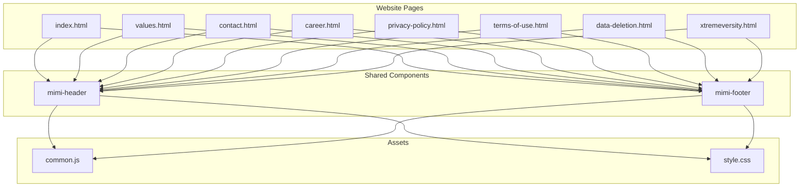
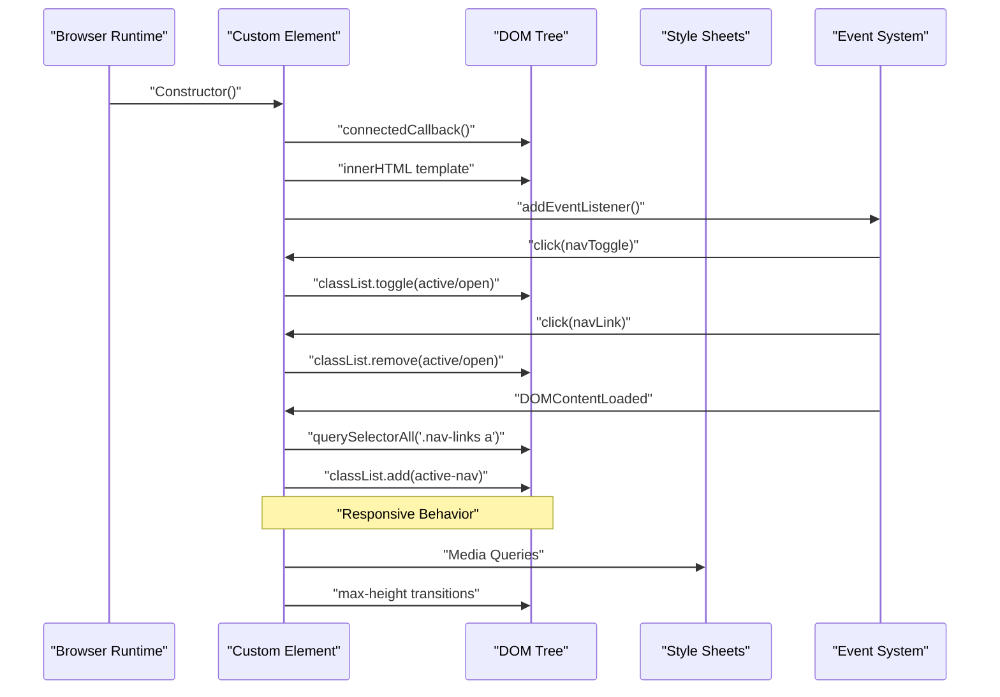
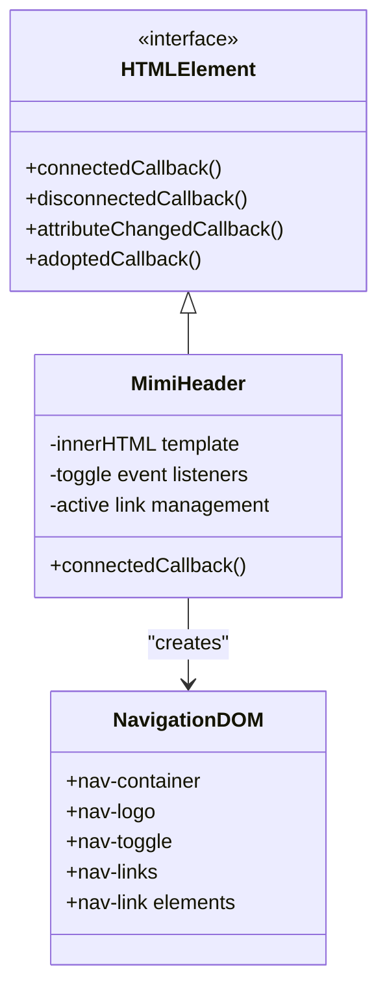
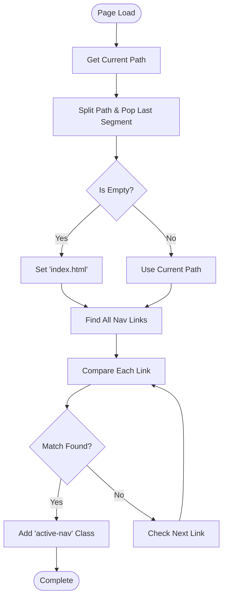
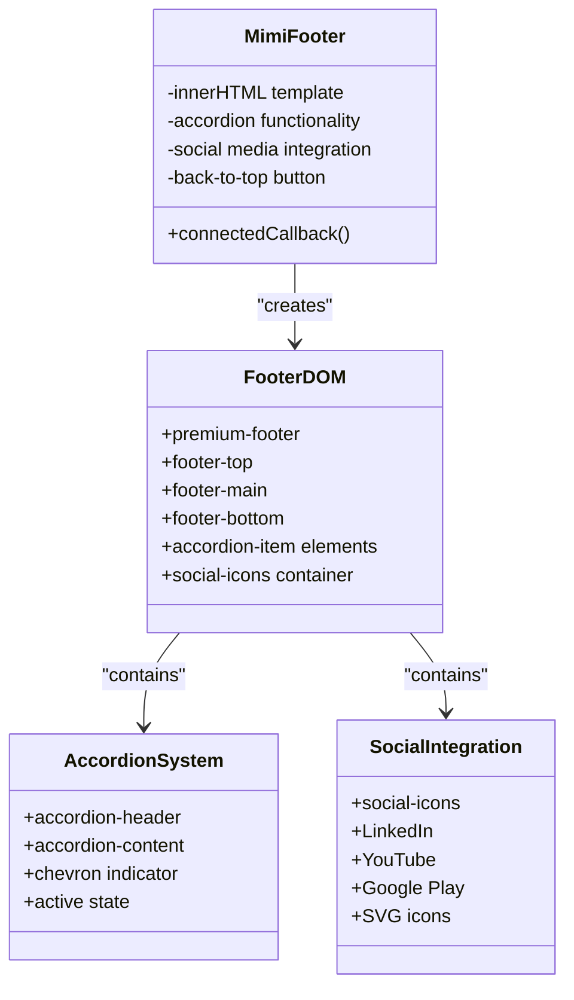
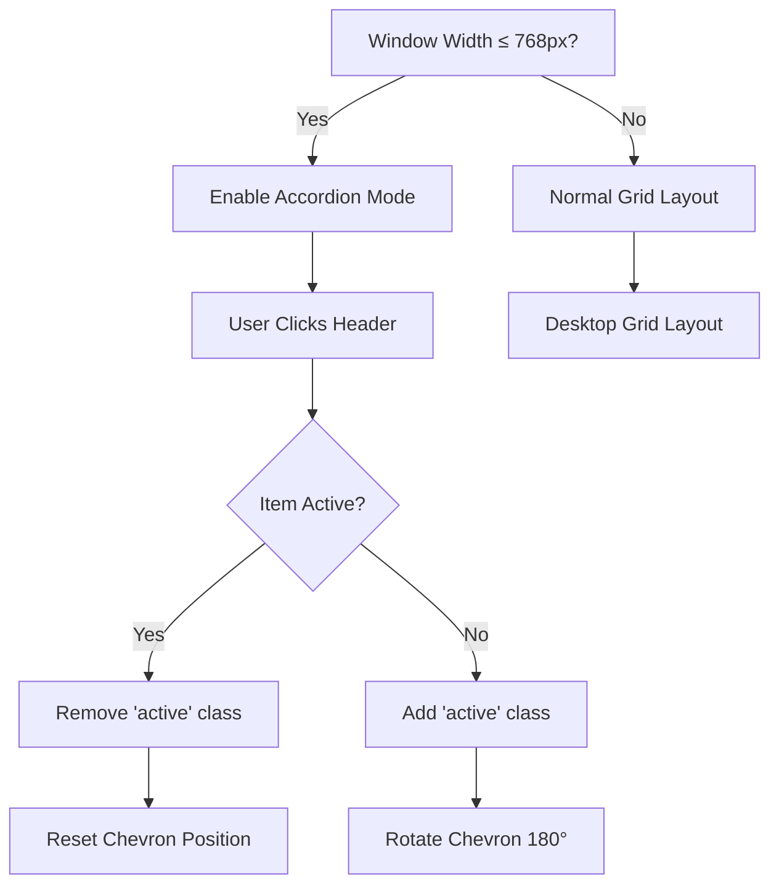
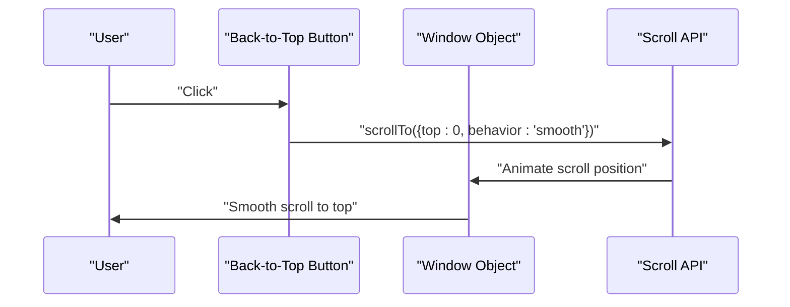
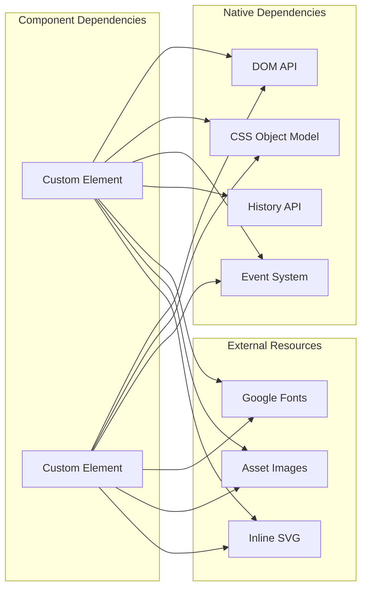

# Core Components

<cite>
**Referenced Files in This Document**
- [common.js](file://assets/js/common.js)
- [style.css](file://assets/css/style.css)
- [index.html](file://index.html)
- [values.html](file://values.html)
- [contact.html](file://contact.html)
- [career.html](file://career.html)
- [privacy-policy.html](file://privacy-policy.html)
- [terms-of-use.html](file://terms-of-use.html)
- [data-deletion.html](file://data-deletion.html)
- [xtremeversity.html](file://xtremeversity.html)
</cite>

## Table of Contents
1. [Introduction](#introduction)
2. [Project Structure](#project-structure)
3. [Core Components](#core-components)
4. [Architecture Overview](#architecture-overview)
5. [Detailed Component Analysis](#detailed-component-analysis)
6. [Dependency Analysis](#dependency-analysis)
7. [Performance Considerations](#performance-considerations)
8. [Troubleshooting Guide](#troubleshooting-guide)
9. [Conclusion](#conclusion)

## Introduction

The Mimi Games website utilizes two core reusable custom elements that provide consistent navigation and footer functionality across all pages. These components are built as Web Components using the Custom Elements API, offering encapsulation, reusability, and maintainability for the entire website ecosystem.

The components follow modern web standards and provide responsive behavior, accessibility features, and cross-browser compatibility. They are designed to be framework-agnostic and can be easily integrated into various page layouts while maintaining consistent user experience.

## Project Structure

The website follows a modular structure with shared components that are included across multiple pages:



**Diagram sources**
- [index.html:87-88](file://index.html#L87-L88)
- [values.html:30](file://values.html#L30)
- [contact.html:42](file://contact.html#L42)
- [common.js:1-51](file://assets/js/common.js#L1-L51)

**Section sources**
- [index.html:87-88](file://index.html#L87-L88)
- [values.html:30](file://values.html#L30)
- [contact.html:42](file://contact.html#L42)
- [career.html:30](file://career.html#L30)
- [privacy-policy.html:36](file://privacy-policy.html#L36)
- [terms-of-use.html:30](file://terms-of-use.html#L30)
- [data-deletion.html:36](file://data-deletion.html#L36)
- [xtremeversity.html:30](file://xtremeversity.html#L30)

## Core Components

The website implements two primary custom elements that serve as the foundation for navigation and footer functionality:

### MimiHeader Component
The MimiHeader component provides a responsive navigation bar with mobile hamburger menu functionality, active link highlighting, and brand consistency across all pages.

### MimiFooter Component
The MimiFooter component delivers an accordion-style mobile navigation, social media integration, back-to-top functionality, and comprehensive site map organization.

Both components are implemented as ES6 classes extending HTMLElement, utilizing the Shadow DOM for encapsulation and providing robust interactivity through event listeners and DOM manipulation.

**Section sources**
- [common.js:1-129](file://assets/js/common.js#L1-L129)

## Architecture Overview

The component architecture follows a unidirectional data flow pattern with event-driven interactions:



**Diagram sources**
- [common.js:2-49](file://assets/js/common.js#L2-L49)
- [common.js:118-126](file://assets/js/common.js#L118-L126)

The architecture emphasizes:
- **Encapsulation**: Each component manages its internal state and DOM structure
- **Event-Driven**: Interactive elements respond to user events through event listeners
- **Responsive Design**: Media queries trigger different behaviors for mobile vs desktop
- **Accessibility**: Proper ARIA attributes and keyboard navigation support

## Detailed Component Analysis

### MimiHeader Component

#### Component Structure and Lifecycle

The MimiHeader component follows the standard Custom Elements lifecycle:



**Diagram sources**
- [common.js:1-51](file://assets/js/common.js#L1-L51)

#### Navigation Logic Implementation

The navigation system implements sophisticated link management:



**Diagram sources**
- [common.js:42-48](file://assets/js/common.js#L42-L48)

#### Mobile Hamburger Menu Functionality

The mobile navigation implements a toggle-based system with visual feedback:

```mermaid
sequenceDiagram
participant User as "User"
participant Toggle as "Hamburger Button"
participant Links as "Navigation Links"
participant Bar1 as "Bar 1"
participant Bar2 as "Bar 2"
participant Bar3 as "Bar 3"
User->>Toggle : "Click"
Toggle->>Links : "classList.toggle('active')"
Toggle->>Bar1 : "transform : rotate(45deg)"
Toggle->>Bar2 : "opacity : 0"
Toggle->>Bar3 : "transform : rotate(-45deg)"
User->>Links : "Click Any Link"
Links->>Links : "classList.remove('active')"
Toggle->>Bar1 : "transform : rotate(0deg)"
Toggle->>Bar2 : "opacity : 1"
Toggle->>Bar3 : "transform : rotate(0deg)"
```

**Diagram sources**
- [common.js:30-40](file://assets/js/common.js#L30-L40)
- [common.js:763-780](file://assets/css/style.css#L763-L780)

#### Responsive Behavior Implementation

The component adapts to different screen sizes through CSS media queries:

| Breakpoint | Behavior | Classes Applied |
|------------|----------|-----------------|
| Desktop (> 900px) | Full horizontal navigation | `.nav-links` visible |
| Mobile (≤ 900px) | Hamburger menu activation | `.nav-toggle` displays |
| Tablet (≤ 768px) | Accordion footer behavior | `.accordion-item` active |

**Section sources**
- [common.js:1-51](file://assets/js/common.js#L1-L51)
- [common.js:30-40](file://assets/js/common.js#L30-L40)
- [common.js:42-48](file://assets/js/common.js#L42-L48)
- [style.css:763-780](file://assets/css/style.css#L763-L780)

### MimiFooter Component

#### Component Structure and Lifecycle

The MimiFooter component provides comprehensive footer functionality:



**Diagram sources**
- [common.js:53-129](file://assets/js/common.js#L53-L129)

#### Accordion-Style Mobile Navigation

The footer implements an accordion system optimized for mobile devices:



**Diagram sources**
- [common.js:118-122](file://assets/js/common.js#L118-L122)
- [style.css:749-760](file://assets/css/style.css#L749-L760)

#### Social Media Integration

The footer integrates with major social platforms through SVG icons:

| Platform | URL Pattern | Accessibility |
|----------|-------------|---------------|
| LinkedIn | `https://www.linkedin.com/company/mimi-game/` | `aria-label="LinkedIn"` |
| YouTube | `https://youtube.com/@mimigames.2k24` | `aria-label="YouTube"` |
| Google Play | `https://play.google.com/store/apps/dev?id=7588389315845065039` | `aria-label="Google Play"` |

Each social icon includes hover effects with platform-specific colors and maintains accessibility compliance.

#### Back-to-Top Button Functionality

The back-to-top button provides smooth scrolling to page top:



**Diagram sources**
- [common.js:124-126](file://assets/js/common.js#L124-L126)

**Section sources**
- [common.js:53-129](file://assets/js/common.js#L53-L129)
- [common.js:118-126](file://assets/js/common.js#L118-L126)
- [style.css:686-747](file://assets/css/style.css#L686-L747)

### Component Communication Patterns

The components utilize several communication patterns:

#### Internal State Management
- **Active Link Tracking**: Each component maintains its own active state through DOM manipulation
- **Event Delegation**: Event listeners are attached to parent containers for efficient memory usage
- **Responsive State**: Components adapt their behavior based on viewport measurements

#### Cross-Component Coordination
- **Shared CSS Variables**: Both components inherit from the global CSS variable system
- **Consistent Styling**: Shared styles ensure visual consistency across components
- **Template Reuse**: Similar structural patterns enable predictable behavior

**Section sources**
- [common.js:1-129](file://assets/js/common.js#L1-L129)
- [style.css:20-42](file://assets/css/style.css#L20-L42)

## Dependency Analysis

The components have minimal external dependencies and rely primarily on native browser APIs:



**Diagram sources**
- [common.js:1-129](file://assets/js/common.js#L1-L129)

### Browser Compatibility Considerations

The components are designed for broad browser compatibility:

| Feature | Minimum Browser Version | Fallback Behavior |
|---------|------------------------|-------------------|
| Custom Elements | Chrome 33, Firefox 63, Safari 10.1 | Graceful degradation |
| CSS Grid | Chrome 57, Firefox 52, Safari 10.1 | Flexbox fallback |
| CSS Variables | Chrome 49, Firefox 31, Safari 9.1 | Static values fallback |
| Intersection Observer | Chrome 51, Firefox 55, Safari 10.1 | Manual scroll detection |
| Transform 3D | Chrome 36, Firefox 16, Safari 9 | 2D transforms fallback |

**Section sources**
- [common.js:131-223](file://assets/js/common.js#L131-L223)

## Performance Considerations

### Memory Management
- **Event Listener Cleanup**: Components remove event listeners during disconnection
- **DOM Reference Management**: Efficient use of querySelectorAll with proper scoping
- **Animation Performance**: Hardware-accelerated transforms using transform3d

### Loading Optimization
- **Lazy Loading**: Components initialize only when needed
- **Efficient Selectors**: Minimal DOM traversal through direct element references
- **CSS Optimization**: Critical path CSS included in head, non-critical styles deferred

### Rendering Performance
- **Transform Properties**: Using transform3d for GPU acceleration
- **Reduced Reflows**: Batched DOM updates through single innerHTML assignment
- **Intersection Observer**: Efficient scroll-based animations without continuous polling

## Troubleshooting Guide

### Common Component Issues

#### Navigation Links Not Highlighting
**Symptoms**: Active link class not applied to current page
**Causes**:
- Incorrect file path resolution
- Case sensitivity in file extensions
- Missing index.html fallback

**Solutions**:
1. Verify file paths match exactly (case-sensitive)
2. Ensure index.html serves as default fallback
3. Check console for path resolution errors

#### Mobile Menu Not Working
**Symptoms**: Hamburger menu doesn't toggle navigation
**Causes**:
- CSS media query conflicts
- JavaScript execution timing issues
- Event listener attachment failures

**Solutions**:
1. Inspect CSS media query breakpoints
2. Ensure script loads after DOMContentLoaded
3. Verify element selectors match generated markup

#### Footer Accordion Not Responding
**Symptoms**: Clicking accordion headers has no effect
**Causes**:
- Window resize event interference
- CSS transition conflicts
- Event bubbling issues

**Solutions**:
1. Check window.innerWidth calculations
2. Verify CSS transition duration values
3. Prevent event propagation conflicts

#### Social Media Icons Not Displaying
**Symptoms**: Social icons appear as empty boxes
**Causes**:
- SVG rendering issues
- CORS policy restrictions
- Inline SVG content problems

**Solutions**:
1. Validate SVG markup integrity
2. Check browser console for rendering errors
3. Ensure proper MIME type handling

### Debugging Techniques

#### Component Inspection
1. **Console Logging**: Add temporary console.log statements in connectedCallback
2. **DOM Inspection**: Use browser dev tools to verify element creation
3. **Event Listener Verification**: Check if event listeners are properly attached

#### Performance Profiling
1. **Memory Usage**: Monitor component lifecycle impact on memory
2. **Rendering Performance**: Use Chrome DevTools Performance tab
3. **Event Handler Efficiency**: Audit event listener performance

#### Cross-Browser Testing
1. **Feature Detection**: Implement graceful degradation for unsupported features
2. **Polyfill Implementation**: Consider adding Custom Elements polyfills for older browsers
3. **CSS Grid Fallbacks**: Ensure flexbox alternatives for older browsers

**Section sources**
- [common.js:1-235](file://assets/js/common.js#L1-L235)

## Conclusion

The Mimi Games website's core reusable components demonstrate excellent implementation of modern web standards through Custom Elements. The MimiHeader and MimiFooter components provide consistent navigation and footer functionality across all pages while maintaining responsive behavior and accessibility compliance.

Key strengths of the implementation include:
- **Modular Design**: Clean separation of concerns with encapsulated functionality
- **Responsive Architecture**: Adaptive behavior through CSS media queries and JavaScript
- **Performance Optimization**: Efficient DOM manipulation and hardware-accelerated animations
- **Cross-Browser Compatibility**: Graceful degradation and feature detection
- **Accessibility Compliance**: Proper ARIA attributes and keyboard navigation support

The components serve as a foundation for the entire website ecosystem, enabling easy maintenance and consistent user experience across all pages. Their implementation provides valuable patterns for other web projects requiring reusable, accessible, and performant UI components.

Future enhancements could include:
- Enhanced testing frameworks for component validation
- Additional customization options through CSS custom properties
- Integration with modern build tools and module bundlers
- Progressive enhancement for improved user experience