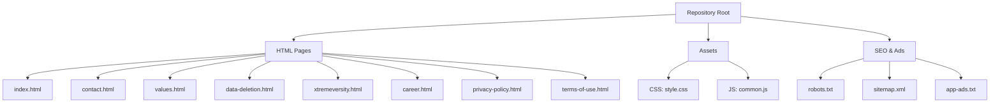
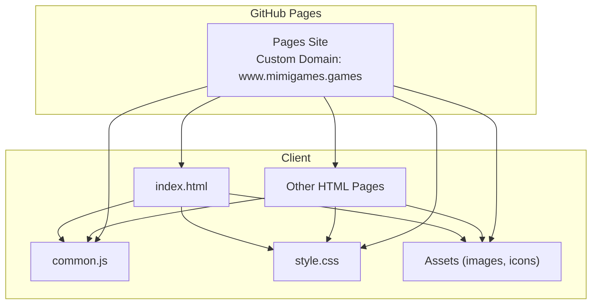
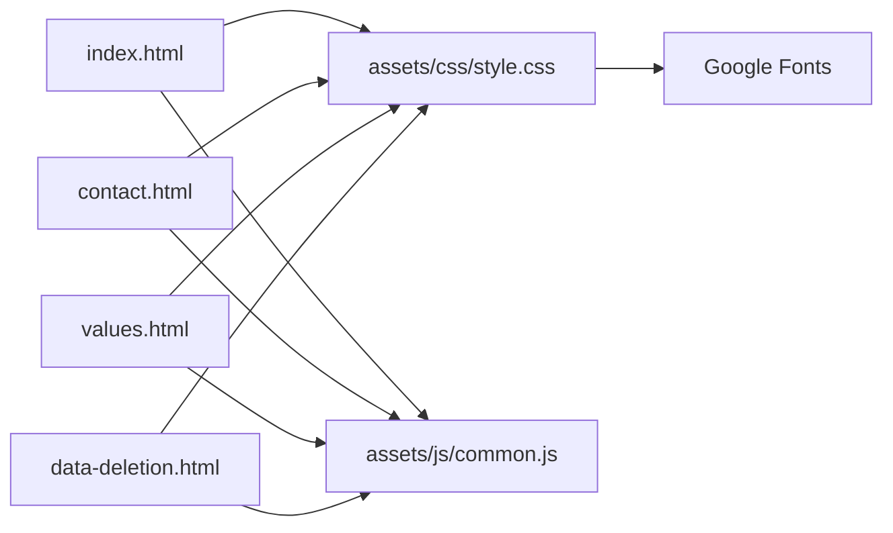

# Deployment and Maintenance

<cite>
**Referenced Files in This Document**
- [README.md](file://README.md)
- [index.html](file://index.html)
- [contact.html](file://contact.html)
- [values.html](file://values.html)
- [data-deletion.html](file://data-deletion.html)
- [robots.txt](file://robots.txt)
- [sitemap.xml](file://sitemap.xml)
- [app-ads.txt](file://app-ads.txt)
- [style.css](file://assets/css/style.css)
- [common.js](file://assets/js/common.js)
</cite>

## Table of Contents
1. [Introduction](#introduction)
2. [Project Structure](#project-structure)
3. [Core Components](#core-components)
4. [Architecture Overview](#architecture-overview)
5. [Detailed Component Analysis](#detailed-component-analysis)
6. [Dependency Analysis](#dependency-analysis)
7. [Performance Considerations](#performance-considerations)
8. [Troubleshooting Guide](#troubleshooting-guide)
9. [Conclusion](#conclusion)
10. [Appendices](#appendices)

## Introduction
This document provides comprehensive guidance for deploying and maintaining the Mimi Games website. It covers GitHub Pages configuration (custom domain, branch selection, and automated deployment), the build and optimization process for static assets, update procedures for content, styles, and features, maintenance tasks (broken link checks, HTML validation, performance monitoring), troubleshooting for common deployment and domain issues, backup and rollback strategies, and security update practices. The website is a static site hosted on GitHub Pages with a custom domain and includes SEO, accessibility, and performance-focused assets.

## Project Structure
The repository is a static website composed of HTML pages, CSS, JavaScript, and supporting SEO and ads files. Key characteristics:
- Static HTML pages for each section (home, contact, values, career, privacy, terms, data deletion, xtremeversity).
- Shared UI components implemented as custom elements (header and footer) loaded via script.
- Centralized styling in a single stylesheet and shared JavaScript for interactive behaviors.
- SEO and discovery files: robots.txt, sitemap.xml, and app-ads.txt.

**Diagram sources**
- [README.md:1-11](file://README.md#L1-L11)
- [index.html:1-501](file://index.html#L1-L501)
- [contact.html](file://contact.html)
- [values.html](file://values.html)
- [data-deletion.html](file://data-deletion.html)
- [robots.txt:1-5](file://robots.txt#L1-L5)
- [sitemap.xml:1-52](file://sitemap.xml#L1-L52)
- [app-ads.txt:1-2](file://app-ads.txt#L1-L2)

**Section sources**
- [README.md:1-11](file://README.md#L1-L11)
- [index.html:1-501](file://index.html#L1-L501)

## Core Components
- Custom Elements: mimi-header and mimi-footer encapsulate navigation and footer UI, reducing duplication and enabling centralized updates.
- Stylesheet: style.css defines a cohesive design system, responsive breakpoints, and animations.
- JavaScript: common.js initializes custom elements, scroll-reveal effects, preloader, parallax backgrounds, 3D tilt effects, particle canvas, and subtle UI audio cues.
- SEO and Ads: robots.txt, sitemap.xml, and app-ads.txt support search engine indexing and ad verification.

Key implementation references:
- Custom elements definition and DOM initialization: [common.js:1-129](file://assets/js/common.js#L1-L129)
- Scroll reveal and preloader lifecycle: [common.js:131-152](file://assets/js/common.js#L131-L152)
- Parallax and 3D tilt effects: [common.js:154-185](file://assets/js/common.js#L154-L185)
- Canvas particle background: [common.js:187-223](file://assets/js/common.js#L187-L223)
- Responsive design and media queries: [style.css:749-797](file://assets/css/style.css#L749-L797)

**Section sources**
- [common.js:1-235](file://assets/js/common.js#L1-L235)
- [style.css:1-845](file://assets/css/style.css#L1-L845)

## Architecture Overview
The site architecture is client-side driven with minimal server-side logic:
- Pages are served statically from GitHub Pages.
- Assets are referenced locally under assets/.
- Custom elements are hydrated on the client after page load.
- SEO and analytics-related files are placed at the repository root for discovery.

**Diagram sources**
- [README.md:10](file://README.md#L10)
- [index.html:10](file://index.html#L10)
- [style.css:16](file://assets/css/style.css#L16)
- [common.js:49](file://assets/js/common.js#L49)

## Detailed Component Analysis

### GitHub Pages Configuration
- Hosting: The site is hosted via GitHub Pages with a custom domain.
- Branch selection: Typical static sites deploy from the main branch (or gh-pages). Verify repository Settings > Pages to confirm the source branch and custom domain.
- Custom domain: Ensure DNS records (CNAME or apex redirect) point to GitHub Pages and that the custom domain is set in repository Settings > Pages.
- Automated deployment: For automated builds, integrate a CI/CD pipeline (e.g., GitHub Actions) to build, optimize, and deploy to the publishing branch. Otherwise, push directly to the source branch.

Operational references:
- Custom domain hosting statement: [README.md:10](file://README.md#L10)

**Section sources**
- [README.md:10](file://README.md#L10)

### Build and Asset Optimization
- Local development: Open index.html in a browser to preview changes.
- Asset references: All assets are linked relatively (e.g., assets/css/style.css, assets/js/common.js). Keep asset paths consistent across pages.
- Optimization checklist:
  - Minimize CSS and JS for production (optional for this small site).
  - Compress images and serve modern formats (e.g., AVIF/WebP) if needed.
  - Enable caching headers via GitHub Pages (via repository settings or CDN).
  - Validate HTML and CSS to maintain accessibility and SEO.

References:
- Asset linking in index.html: [index.html:10](file://index.html#L10)
- Font imports and favicon references: [index.html:9-13](file://index.html#L9-L13)
- Stylesheet import: [style.css:16](file://assets/css/style.css#L16)

**Section sources**
- [index.html:9-13](file://index.html#L9-L13)
- [index.html:10](file://index.html#L10)
- [style.css:16](file://assets/css/style.css#L16)

### Content Updates
- Edit HTML pages directly for textual content changes.
- Update canonical URLs and meta tags in head sections to keep SEO consistent.
- Maintain sitemap.xml and robots.txt to reflect new pages or redirects.

References:
- Canonical URL and meta tags: [index.html:8](file://index.html#L8), [index.html:16-24](file://index.html#L16-L24)
- Sitemap entries: [sitemap.xml:3-51](file://sitemap.xml#L3-L51)
- Robots directive: [robots.txt:1-4](file://robots.txt#L1-L4)

**Section sources**
- [index.html:8](file://index.html#L8)
- [index.html:16-24](file://index.html#L16-L24)
- [sitemap.xml:3-51](file://sitemap.xml#L3-L51)
- [robots.txt:1-4](file://robots.txt#L1-L4)

### Style Modifications
- Centralized styling in style.css enables consistent updates.
- Media queries handle responsive behavior; test across breakpoints.
- Animations and transitions rely on CSS keyframes; verify performance on low-end devices.

References:
- Responsive media queries: [style.css:749-797](file://assets/css/style.css#L749-L797)

**Section sources**
- [style.css:749-797](file://assets/css/style.css#L749-L797)

### New Feature Additions
- Use custom elements (mimi-header, mimi-footer) to avoid duplicating markup.
- Extend common.js for new interactive features; ensure compatibility with existing observers and event listeners.
- Add new pages and update sitemap.xml and robots.txt accordingly.

References:
- Custom element definitions: [common.js:1-129](file://assets/js/common.js#L1-L129)
- Footer content and links: [common.js:53-129](file://assets/js/common.js#L53-L129)

**Section sources**
- [common.js:1-129](file://assets/js/common.js#L1-L129)
- [common.js:53-129](file://assets/js/common.js#L53-L129)

### Maintenance Tasks
- Broken link checks: Use tools to crawl the live site and verify internal links.
- HTML validation: Validate pages against HTML5 standards to prevent rendering issues.
- Performance monitoring: Track Core Web Vitals, Lighthouse scores, and asset sizes.
- SEO audits: Confirm canonical URLs, meta descriptions, structured data, and sitemap submission.

References:
- Sitemap submission via robots.txt: [robots.txt:4](file://robots.txt#L4)
- Structured data in index.html: [index.html:26-74](file://index.html#L26-L74)

**Section sources**
- [robots.txt:4](file://robots.txt#L4)
- [index.html:26-74](file://index.html#L26-L74)

### Troubleshooting Guide
Common deployment and domain issues:
- Custom domain not loading:
  - Verify DNS configuration and CNAME/apex settings.
  - Confirm custom domain in repository Settings > Pages.
- GitHub Pages build failures:
  - Check branch selection and file paths.
  - Ensure assets are committed and reachable.
- Mixed content errors:
  - Serve all assets over HTTPS; avoid http:// links.
- SEO and indexing issues:
  - Confirm robots.txt allows crawling and sitemap location.
  - Validate structured data and canonical URLs.

References:
- Custom domain hosting note: [README.md:10](file://README.md#L10)
- robots.txt directives: [robots.txt:1-4](file://robots.txt#L1-L4)
- sitemap.xml structure: [sitemap.xml:1-52](file://sitemap.xml#L1-L52)

**Section sources**
- [README.md:10](file://README.md#L10)
- [robots.txt:1-4](file://robots.txt#L1-L4)
- [sitemap.xml:1-52](file://sitemap.xml#L1-L52)

### Backup and Rollback Procedures
- Backups:
  - Export the repository history and tag releases for each deployment.
  - Snapshot the last-known-good commit hash.
- Rollback:
  - Temporarily switch the GitHub Pages source branch to a previous commit.
  - Alternatively, revert problematic commits and redeploy.
- Change management:
  - Use pull requests and review before merging to the source branch.
  - Maintain a changelog of updates.

[No sources needed since this section provides general guidance]

### Security Updates
- Keep external resources up to date:
  - Review font and CDN links periodically.
- Monitor ads and analytics:
  - Validate app-ads.txt and adjust as needed.
- Access control:
  - Restrict repository permissions and enable two-factor authentication.

References:
- AdMob verification file: [app-ads.txt:1-2](file://app-ads.txt#L1-L2)

**Section sources**
- [app-ads.txt:1-2](file://app-ads.txt#L1-L2)

## Dependency Analysis
The site’s runtime dependencies are minimal and explicit:
- HTML pages depend on local CSS and JS.
- CSS depends on Google Fonts via external links.
- JavaScript depends on DOM APIs and IntersectionObserver for scroll effects.

**Diagram sources**
- [index.html:10](file://index.html#L10)
- [style.css:16](file://assets/css/style.css#L16)
- [common.js:49](file://assets/js/common.js#L49)

**Section sources**
- [index.html:10](file://index.html#L10)
- [style.css:16](file://assets/css/style.css#L16)
- [common.js:49](file://assets/js/common.js#L49)

## Performance Considerations
- Reduce render-blocking resources: Inline critical CSS for above-the-fold content if needed.
- Optimize images: Compress and consider modern formats.
- Minimize third-party dependencies: Keep external font and script loads lean.
- Monitor Core Web Vitals: Use Lighthouse and real-user monitoring to track improvements.

[No sources needed since this section provides general guidance]

## Conclusion
The Mimi Games website is a straightforward static site suitable for GitHub Pages with a custom domain. By following the deployment steps, maintaining SEO and accessibility, and applying the troubleshooting and maintenance practices outlined here, you can ensure reliable availability, performance, and a positive user experience.

[No sources needed since this section summarizes without analyzing specific files]

## Appendices

### Appendix A: Page-to-Asset Reference
- index.html references:
  - Stylesheet: [index.html:10](file://index.html#L10)
  - Scripts: [index.html:499](file://index.html#L499)
  - Meta tags and canonical: [index.html:7-8](file://index.html#L7-L8), [index.html:16-24](file://index.html#L16-L24)
- Contact page references:
  - Header and hero section: [contact.html:42-51](file://contact.html#L42-L51)
  - Form action: [contact.html:59](file://contact.html#L59)
- Values page references:
  - Hero section: [values.html:30-39](file://values.html#L30-L39)
- Data deletion page references:
  - Data table: [data-deletion.html:103-121](file://data-deletion.html#L103-L121)

**Section sources**
- [index.html:7-8](file://index.html#L7-L8)
- [index.html:10](file://index.html#L10)
- [index.html:16-24](file://index.html#L16-L24)
- [index.html:499](file://index.html#L499)
- [contact.html:42-51](file://contact.html#L42-L51)
- [contact.html:59](file://contact.html#L59)
- [values.html:30-39](file://values.html#L30-L39)
- [data-deletion.html:103-121](file://data-deletion.html#L103-L121)