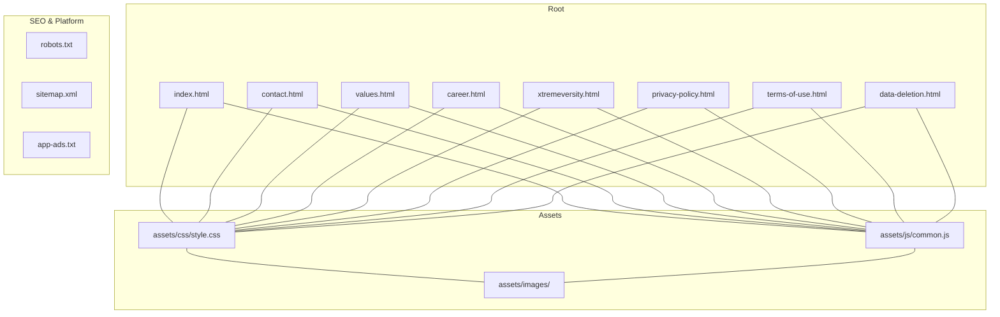
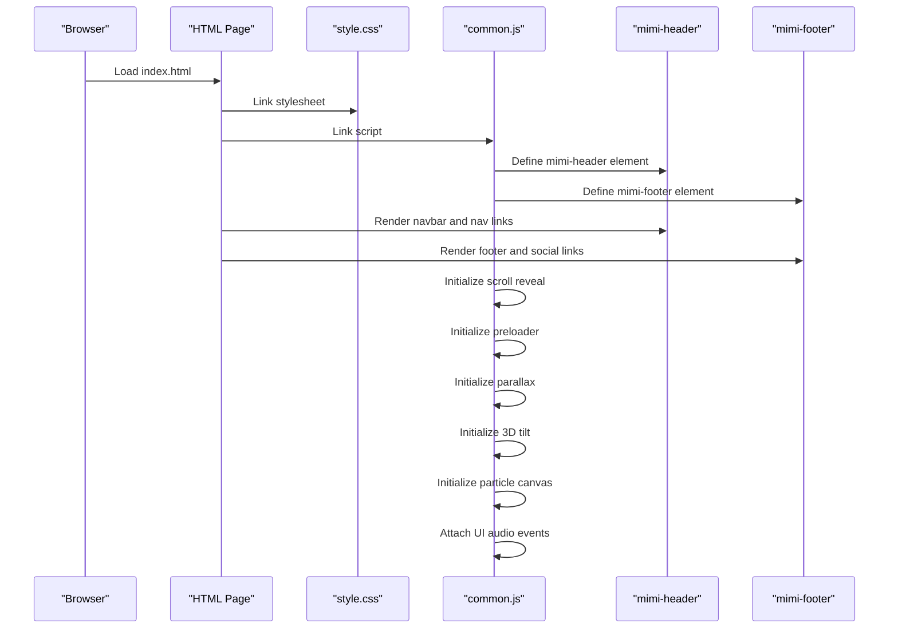
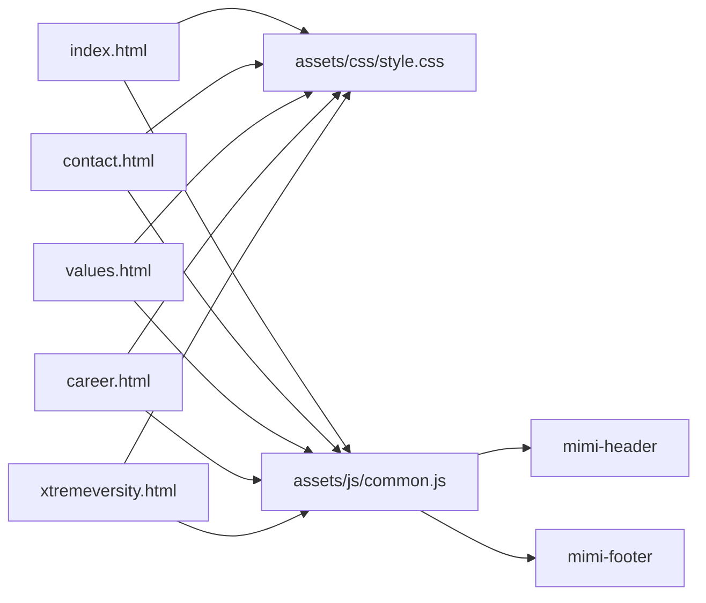

# Getting Started

<cite>
**Referenced Files in This Document**
- [README.md](file://README.md)
- [index.html](file://index.html)
- [contact.html](file://contact.html)
- [values.html](file://values.html)
- [career.html](file://career.html)
- [xtremeversity.html](file://xtremeversity.html)
- [assets/css/style.css](file://assets/css/style.css)
- [assets/js/common.js](file://assets/js/common.js)
- [robots.txt](file://robots.txt)
- [sitemap.xml](file://sitemap.xml)
- [app-ads.txt](file://app-ads.txt)
</cite>

## Table of Contents
1. [Introduction](#introduction)
2. [Prerequisites](#prerequisites)
3. [Local Development Setup](#local-development-setup)
4. [Project Structure](#project-structure)
5. [Architecture Overview](#architecture-overview)
6. [Detailed Component Analysis](#detailed-component-analysis)
7. [Dependency Analysis](#dependency-analysis)
8. [Performance Considerations](#performance-considerations)
9. [Browser Compatibility and Testing](#browser-compatibility-and-testing)
10. [Making Modifications](#making-modifications)
11. [Deployment to GitHub Pages](#deployment-to-github-pages)
12. [Troubleshooting Guide](#troubleshooting-guide)
13. [Conclusion](#conclusion)

## Introduction
This guide helps you set up and work on the Mimi Games website locally, understand how the HTML pages, CSS stylesheets, and JavaScript files collaborate, and deploy the site to GitHub Pages with a custom domain. The site is a collection of static HTML pages styled with a central stylesheet and powered by a shared JavaScript module that defines reusable web components and interactive behaviors.

**Section sources**
- [README.md:1-11](file://README.md#L1-L11)

## Prerequisites
- Basic HTML: Understand tags, structure, meta attributes, and linking resources.
- Basic CSS: Know selectors, variables, pseudo-elements, and responsive breakpoints.
- Basic JavaScript: Understand DOM manipulation, event listeners, and ES6 features.
- Local server: Use a simple HTTP server to preview changes without browser security errors.

## Local Development Setup
Follow these steps to run the site locally:

1. Clone or download the repository to your machine.
2. Open a terminal in the project root.
3. Start a simple HTTP server:
   - Python 3: python -m http.server 8000
   - Python 2: python -m SimpleHTTPServer 8000
   - Node.js (with http-server): npx http-server
   - PHP: php -S localhost:8000
4. Visit http://localhost:8000 in your browser.

Notes:
- Some browsers restrict loading local files directly due to CORS. Using a local HTTP server avoids these issues.
- After editing files, refresh the browser to see changes.

## Project Structure
The site is organized around a small set of HTML pages and shared assets:

- Root HTML pages: index.html, contact.html, values.html, career.html, xtremeversity.html, plus legal and policy pages referenced by the footer.
- Shared assets:
  - CSS: assets/css/style.css
  - JavaScript: assets/js/common.js
  - Images: assets/images/ (favicon, logos, game images)
- SEO and platform files: robots.txt, sitemap.xml, app-ads.txt

**Diagram sources**
- [index.html:1-501](file://index.html#L1-L501)
- [contact.html:1-130](file://contact.html#L1-L130)
- [values.html:1-107](file://values.html#L1-L107)
- [career.html:1-100](file://career.html#L1-L100)
- [xtremeversity.html:1-91](file://xtremeversity.html#L1-L91)
- [assets/css/style.css:1-845](file://assets/css/style.css#L1-L845)
- [assets/js/common.js:1-235](file://assets/js/common.js#L1-L235)
- [robots.txt:1-5](file://robots.txt#L1-L5)
- [sitemap.xml:1-52](file://sitemap.xml#L1-L52)
- [app-ads.txt:1-2](file://app-ads.txt#L1-L2)

**Section sources**
- [README.md:1-11](file://README.md#L1-L11)
- [index.html:1-501](file://index.html#L1-L501)
- [assets/css/style.css:1-845](file://assets/css/style.css#L1-L845)
- [assets/js/common.js:1-235](file://assets/js/common.js#L1-L235)
- [robots.txt:1-5](file://robots.txt#L1-L5)
- [sitemap.xml:1-52](file://sitemap.xml#L1-L52)
- [app-ads.txt:1-2](file://app-ads.txt#L1-L2)

## Architecture Overview
The site uses a modular approach:
- HTML pages include a shared stylesheet and a shared script.
- The script defines two custom elements (header and footer) that are reused across pages.
- CSS variables define the theme and are used throughout the pages.
- JavaScript handles navigation toggles, scroll reveal effects, preloader, parallax, 3D tilt, particle canvas, and subtle UI audio.

**Diagram sources**
- [index.html:1-501](file://index.html#L1-L501)
- [assets/css/style.css:1-845](file://assets/css/style.css#L1-L845)
- [assets/js/common.js:1-235](file://assets/js/common.js#L1-L235)

## Detailed Component Analysis

### CSS Variables and Theme
The stylesheet defines a cohesive color palette and typography system using CSS variables. These variables are referenced across pages to maintain consistent theming.

Key aspects:
- Palette variables for dark backgrounds, accents, and muted text.
- Typography families and sizes.
- Utility classes for buttons, badges, and layout containers.
- Responsive breakpoints for mobile navigation and content grids.

**Section sources**
- [assets/css/style.css:20-42](file://assets/css/style.css#L20-L42)
- [assets/css/style.css:72-94](file://assets/css/style.css#L72-L94)
- [assets/css/style.css:131-162](file://assets/css/style.css#L131-L162)
- [assets/css/style.css:749-797](file://assets/css/style.css#L749-L797)

### Web Components: mimi-header and mimi-footer
The JavaScript module registers two custom elements:
- mimi-header: Renders the navigation bar, logo, and links. Handles mobile menu toggle and active link highlighting.
- mimi-footer: Renders the footer columns, accordion behavior on mobile, social icons, and a back-to-top button.

Behavior highlights:
- Navigation toggle opens/closes the mobile menu.
- Active link detection based on current page.
- Accordion headers expand/collapse on small screens.
- Back-to-top scrolls smoothly to the top.

**Section sources**
- [assets/js/common.js:1-51](file://assets/js/common.js#L1-L51)
- [assets/js/common.js:53-129](file://assets/js/common.js#L53-L129)

### Interactive Effects
The script adds several interactive features:
- Scroll reveal: Elements animate into view when scrolled into the viewport.
- Preloader: Fades out after page load.
- Parallax: Backgrounds move at a slower rate during scroll.
- 3D tilt: Cards tilt based on mouse position on desktop.
- Particle canvas: Animated background particles inside the hero section.
- UI audio: Plays subtle sound on hover for interactive elements.

**Section sources**
- [assets/js/common.js:131-142](file://assets/js/common.js#L131-L142)
- [assets/js/common.js:144-152](file://assets/js/common.js#L144-L152)
- [assets/js/common.js:154-163](file://assets/js/common.js#L154-L163)
- [assets/js/common.js:165-186](file://assets/js/common.js#L165-L186)
- [assets/js/common.js:187-223](file://assets/js/common.js#L187-L223)
- [assets/js/common.js:225-235](file://assets/js/common.js#L225-L235)

### Page Structure Patterns
Each page follows a similar structure:
- Head includes meta tags, canonical URL, fonts, and stylesheet.
- Body includes the mimi-header and mimi-footer elements.
- Content sections use shared classes (e.g., hero, editorial, glass-section) for consistent layout and styling.
- Scripts are included at the end of the body.

Examples:
- index.html demonstrates the hero, stats, featured game, and community sections.
- contact.html shows a form styled with CSS variables.
- values.html and career.html use the same reusable components and layout patterns.
- xtremeversity.html focuses on a game teaser and feature cards.

**Section sources**
- [index.html:1-501](file://index.html#L1-L501)
- [contact.html:1-130](file://contact.html#L1-L130)
- [values.html:1-107](file://values.html#L1-L107)
- [career.html:1-100](file://career.html#L1-L100)
- [xtremeversity.html:1-91](file://xtremeversity.html#L1-L91)

## Dependency Analysis
The HTML pages depend on the shared stylesheet and script. The script depends on the DOM and browser APIs. The footer references external social profiles and stores a link to the Google Play developer page.

**Diagram sources**
- [index.html:1-501](file://index.html#L1-L501)
- [contact.html:1-130](file://contact.html#L1-L130)
- [values.html:1-107](file://values.html#L1-L107)
- [career.html:1-100](file://career.html#L1-L100)
- [xtremeversity.html:1-91](file://xtremeversity.html#L1-L91)
- [assets/css/style.css:1-845](file://assets/css/style.css#L1-L845)
- [assets/js/common.js:1-235](file://assets/js/common.js#L1-L235)

**Section sources**
- [index.html:1-501](file://index.html#L1-L501)
- [assets/css/style.css:1-845](file://assets/css/style.css#L1-L845)
- [assets/js/common.js:1-235](file://assets/js/common.js#L1-L235)

## Performance Considerations
- Keep asset sizes minimal; images should be optimized for web.
- Avoid heavy animations on low-end devices; the tilt effect is disabled on small screens.
- Use CSS variables for consistent theming to reduce duplication and improve maintainability.
- Lazy-load non-critical resources if extending the site.
- Monitor paint and composite costs for animations and parallax effects.

## Browser Compatibility and Testing
- Modern browsers: The site relies on ES6 features and modern APIs. Ensure testing on recent Chrome, Firefox, Safari, and Edge.
- Mobile: The design is responsive with dedicated mobile navigation and accordion footers.
- Accessibility: Ensure links and buttons are keyboard accessible and screen-reader friendly.
- Testing checklist:
  - Desktop: Verify navigation, hover effects, and parallax.
  - Tablet: Confirm mobile menu toggling and accordion behavior.
  - Phone: Test small-screen layouts and tap targets.
  - Cross-browser: Compare rendering differences and fix inconsistencies.

## Making Modifications

### Update Content
- Edit the relevant HTML page (e.g., index.html, contact.html).
- Modify headings, paragraphs, lists, and links as needed.
- Preserve the reuse of mimi-header and mimi-footer.

**Section sources**
- [index.html:1-501](file://index.html#L1-L501)
- [contact.html:1-130](file://contact.html#L1-L130)

### Change Colors Through CSS Variables
- Adjust color variables in the :root block to update the theme globally.
- Apply variables across components using var(--variable-name) to keep changes consistent.

**Section sources**
- [assets/css/style.css:20-42](file://assets/css/style.css#L20-L42)

### Add New Pages
- Create a new HTML file in the root directory.
- Include the standard head (meta tags, canonical, fonts, stylesheet) and body structure with mimi-header and mimi-footer.
- Reference the new page from the header/footer navigation in the JavaScript module.

Steps:
1. Create a new HTML file (e.g., newpage.html).
2. Add the standard structure and content.
3. Update the navigation arrays in the mimi-header class to include the new page.
4. Optionally add the page to the sitemap.xml.

**Section sources**
- [assets/js/common.js:16-22](file://assets/js/common.js#L16-L22)
- [sitemap.xml:1-52](file://sitemap.xml#L1-L52)

## Deployment to GitHub Pages
The site is hosted via GitHub Pages with a custom domain. Follow these steps:

1. Push your changes to the repository.
2. Enable GitHub Pages in repository Settings:
   - Select the branch (e.g., main) and folder (/root).
3. Configure a custom domain:
   - Go to Settings > Pages > Custom domain and enter your domain.
   - Ensure DNS records point to GitHub Pages.
4. Verify robots.txt and sitemap.xml are present so crawlers can index the site.

Files involved:
- robots.txt: Allows indexing and points to sitemap.xml.
- sitemap.xml: Lists URLs with priorities and change frequencies.
- app-ads.txt: AdMob verification file.

**Section sources**
- [README.md:10](file://README.md#L10)
- [robots.txt:1-5](file://robots.txt#L1-L5)
- [sitemap.xml:1-52](file://sitemap.xml#L1-L52)
- [app-ads.txt:1-2](file://app-ads.txt#L1-L2)

## Troubleshooting Guide
Common issues and resolutions:
- Blank page or missing styles:
  - Ensure assets/css/style.css is linked correctly and reachable.
  - Use a local HTTP server to avoid CORS issues.
- Navigation not working:
  - Confirm mimi-header is defined before DOMContentLoaded.
  - Check that the current page filename matches the active link logic.
- Mobile menu not toggling:
  - Verify the navToggle and navLinks IDs match the script.
  - Ensure the script runs after the DOM is ready.
- Footer accordion not opening:
  - Confirm the accordion headers are bound on click.
  - Check that the script runs on load.
- Parallax or tilt not working:
  - Ensure the relevant DOM elements exist.
  - Confirm the script runs after the DOM is ready.
- Preloader not hiding:
  - Verify the load event fires and the preloader element exists.

**Section sources**
- [assets/js/common.js:131-142](file://assets/js/common.js#L131-L142)
- [assets/js/common.js:144-152](file://assets/js/common.js#L144-L152)
- [assets/js/common.js:154-163](file://assets/js/common.js#L154-L163)
- [assets/js/common.js:165-186](file://assets/js/common.js#L165-L186)
- [assets/js/common.js:187-223](file://assets/js/common.js#L187-L223)

## Conclusion
With a simple local HTTP server, you can preview and modify the Mimi Games website. The shared CSS variables and JavaScript components enable consistent theming and behavior across pages. For deployment, GitHub Pages with a custom domain is already configured, and SEO files (robots.txt, sitemap.xml) are included. Use the troubleshooting tips to resolve common issues quickly.