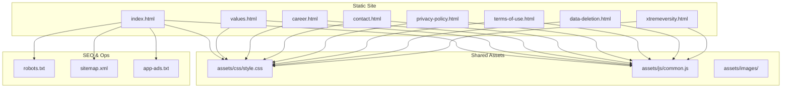
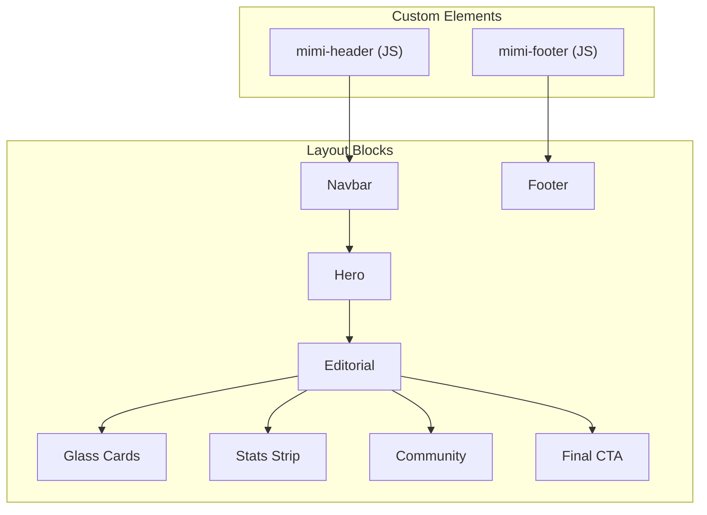
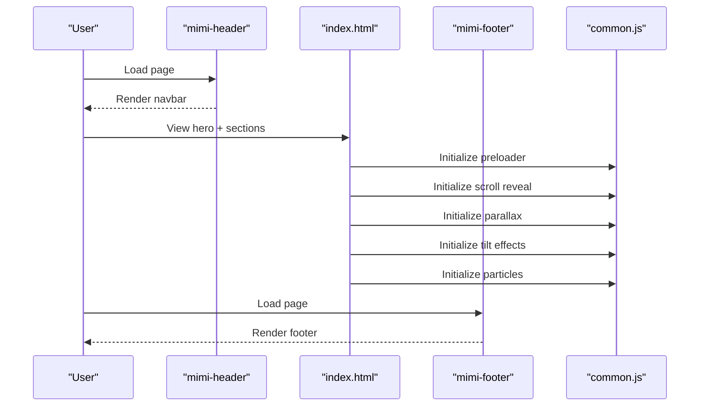
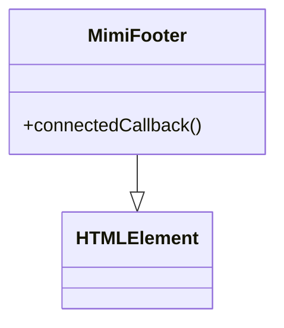
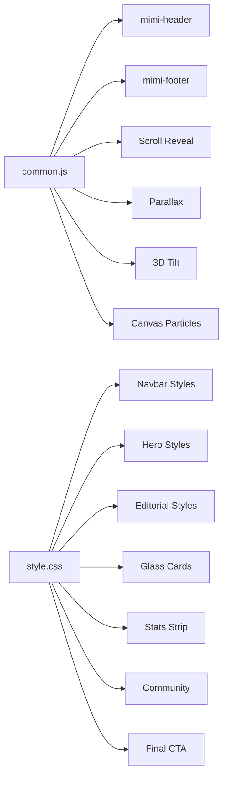

# Page Templates

<cite>
**Referenced Files in This Document**
- [index.html](file://index.html)
- [career.html](file://career.html)
- [contact.html](file://contact.html)
- [privacy-policy.html](file://privacy-policy.html)
- [terms-of-use.html](file://terms-of-use.html)
- [values.html](file://values.html)
- [data-deletion.html](file://data-deletion.html)
- [xtremeversity.html](file://xtremeversity.html)
- [assets/css/style.css](file://assets/css/style.css)
- [assets/js/common.js](file://assets/js/common.js)
- [robots.txt](file://robots.txt)
- [sitemap.xml](file://sitemap.xml)
- [app-ads.txt](file://app-ads.txt)
- [README.md](file://README.md)
</cite>

## Table of Contents
1. [Introduction](#introduction)
2. [Project Structure](#project-structure)
3. [Core Components](#core-components)
4. [Architecture Overview](#architecture-overview)
5. [Detailed Component Analysis](#detailed-component-analysis)
6. [Dependency Analysis](#dependency-analysis)
7. [Performance Considerations](#performance-considerations)
8. [Troubleshooting Guide](#troubleshooting-guide)
9. [Conclusion](#conclusion)
10. [Appendices](#appendices)

## Introduction
This document describes the Mimi Games website page templates and structure. It explains the landing page template (hero, showcase, CTAs), the game-specific page template for Xtremeversity, informational templates for company values, careers, and contact, and legal compliance templates for privacy policy, terms of use, and data deletion. It also documents shared structural elements (header, footer), meta tag configurations, and SEO optimization patterns including structured data and sitemap/robots configuration.

## Project Structure
The site is a static HTML/CSS/JS site hosted on GitHub Pages with a custom domain. All pages share a common theme and layout system built around reusable components and a consistent design language.

**Diagram sources**
- [index.html:1-501](file://index.html#L1-L501)
- [values.html:1-107](file://values.html#L1-L107)
- [career.html:1-100](file://career.html#L1-L100)
- [contact.html:1-130](file://contact.html#L1-L130)
- [privacy-policy.html:1-502](file://privacy-policy.html#L1-L502)
- [terms-of-use.html:1-104](file://terms-of-use.html#L1-L104)
- [data-deletion.html:1-173](file://data-deletion.html#L1-L173)
- [xtremeversity.html:1-91](file://xtremeversity.html#L1-L91)
- [assets/css/style.css:1-845](file://assets/css/style.css#L1-L845)
- [assets/js/common.js:1-235](file://assets/js/common.js#L1-L235)
- [robots.txt:1-5](file://robots.txt#L1-L5)
- [sitemap.xml:1-52](file://sitemap.xml#L1-L52)
- [app-ads.txt:1-2](file://app-ads.txt#L1-L2)

**Section sources**
- [README.md:1-11](file://README.md#L1-L11)
- [index.html:1-501](file://index.html#L1-L501)
- [assets/css/style.css:1-845](file://assets/css/style.css#L1-L845)
- [assets/js/common.js:1-235](file://assets/js/common.js#L1-L235)
- [robots.txt:1-5](file://robots.txt#L1-L5)
- [sitemap.xml:1-52](file://sitemap.xml#L1-L52)
- [app-ads.txt:1-2](file://app-ads.txt#L1-L2)

## Core Components
- Shared header and navigation: Implemented as a custom element that renders a responsive navbar with active-link highlighting and mobile menu toggle.
- Shared footer: Implemented as a custom element with collapsible sections, social links, and back-to-top button.
- Hero sections: Consistent hero blocks with gradient orbs, animated HUD geometry, and scroll indicators across landing and informational pages.
- Content sections: Editorial two-column layouts, glass cards, stats strips, tech stacks, team bios, mission statements, and final CTAs.
- Game showcase: Dedicated sections for featured games and teaser content with hover effects and parallax backgrounds.
- Legal and informational pages: Privacy policy, terms of use, data deletion, values, careers, and contact pages with consistent hero and editorial layouts.
- SEO and structured data: Canonical URLs, Open Graph, Twitter Card, and JSON-LD for Organization and MobileApplication.

**Section sources**
- [assets/js/common.js:1-129](file://assets/js/common.js#L1-L129)
- [assets/css/style.css:172-400](file://assets/css/style.css#L172-L400)
- [assets/css/style.css:446-685](file://assets/css/style.css#L446-L685)
- [index.html:76-501](file://index.html#L76-L501)
- [values.html:20-107](file://values.html#L20-L107)
- [career.html:20-100](file://career.html#L20-L100)
- [contact.html:32-130](file://contact.html#L32-L130)
- [privacy-policy.html:26-502](file://privacy-policy.html#L26-L502)
- [terms-of-use.html:20-104](file://terms-of-use.html#L20-L104)
- [data-deletion.html:26-173](file://data-deletion.html#L26-L173)
- [xtremeversity.html:20-91](file://xtremeversity.html#L20-L91)

## Architecture Overview
The site uses a hybrid theme combining editorial storytelling with cyber-gaming aesthetics. Pages share a common palette, typography, and component library. The custom elements encapsulate navigation and footer behavior, while CSS defines responsive grids, animations, and visual effects. JavaScript handles preloader, scroll reveal, parallax, tilt effects, and particle backgrounds.

**Diagram sources**
- [assets/js/common.js:1-129](file://assets/js/common.js#L1-L129)
- [assets/css/style.css:172-685](file://assets/css/style.css#L172-L685)
- [index.html:76-501](file://index.html#L76-L501)

## Detailed Component Analysis

### Landing Page Template (index.html)
Key sections:
- Hero: Full-screen cinematic with animated HUD geometry, floating orbs, gradient mesh background, scroll indicator, and dual CTA buttons.
- Ticker strip: Horizontal scrolling brand and product highlights.
- Stats strip: Hoverable statistics with animated counters.
- About the studio: Two-column editorial with accent quote and link to values.
- Featured game showcase: Numbered feature list with image visualizer and primary CTA.
- What we build: Glass cards for genres.
- Technologies: Tech stack presentation with animated cells.
- Team: Grid of team member cards.
- Mission: Manifesto block with pill tags.
- Xtremeversity teaser: Parallax background with teaser content and link.
- Community: Social links grid.
- Final CTA: Prominent call-to-action with dual buttons.

SEO and structured data:
- Canonical URL set to the homepage.
- Open Graph and Twitter Card meta tags.
- JSON-LD for Organization and MobileApplication (Rogue Wheel) enabling rich results.

**Diagram sources**
- [index.html:76-501](file://index.html#L76-L501)
- [assets/js/common.js:131-223](file://assets/js/common.js#L131-L223)

**Section sources**
- [index.html:76-501](file://index.html#L76-L501)
- [assets/css/style.css:219-400](file://assets/css/style.css#L219-L400)
- [assets/css/style.css:446-685](file://assets/css/style.css#L446-L685)
- [assets/js/common.js:131-223](file://assets/js/common.js#L131-L223)

### Game-Specific Page Template (xtremeversity.html)
Purpose: Showcase the upcoming game Xtremeversity with a cinematic teaser, about section, and glass feature cards.

Structure:
- Hero teaser: Full-width teaser with background image, badge, and headline.
- About the game: Two-column editorial with game description.
- Glass feature cards: Cards for open world freedom, vehicles, FPS combat, and enemies.

Integration:
- Social links and community section present on landing page; this page focuses on game-specific content.

**Section sources**
- [xtremeversity.html:20-91](file://xtremeversity.html#L20-L91)
- [assets/css/style.css:629-646](file://assets/css/style.css#L629-L646)
- [assets/css/style.css:511-548](file://assets/css/style.css#L511-L548)

### Informational Page Templates

#### Company Values (values.html)
- Hero: Minimalist hero with label and headline.
- Vision: Editorial two-column with quote and bullet list.
- Pillars: Numbered list of core focus areas.

**Section sources**
- [values.html:20-107](file://values.html#L20-L107)
- [assets/css/style.css:446-471](file://assets/css/style.css#L446-L471)

#### Careers (career.html)
- Hero: Minimalist hero with label and headline.
- Open roles: Two-column editorial with role listings and apply button.

**Section sources**
- [career.html:20-100](file://career.html#L20-L100)
- [assets/css/style.css:446-471](file://assets/css/style.css#L446-L471)

#### Contact (contact.html)
- Hero: Minimalist hero with label and headline.
- Contact form: Styled form with inputs and submit button.
- Direct lines: List of contact details.
- Community: Social links grid.

**Section sources**
- [contact.html:32-130](file://contact.html#L32-L130)
- [assets/css/style.css:446-471](file://assets/css/style.css#L446-L471)

### Legal Compliance Page Templates

#### Privacy Policy (privacy-policy.html)
- Hero: Dark-themed hero with label and dates.
- Comprehensive policy content covering data collection, sharing, children’s privacy, security, and deletion procedures.
- References to third-party SDKs and opt-out mechanisms.

**Section sources**
- [privacy-policy.html:26-502](file://privacy-policy.html#L26-L502)

#### Terms of Use (terms-of-use.html)
- Hero: Dark-themed hero with label and effective date.
- Legal terms covering acceptance, license, conduct, intellectual property, virtual items, disclaimers, limitation of liability, platform terms, maintenance, product claims, third-party beneficiary, and governing law.

**Section sources**
- [terms-of-use.html:20-104](file://terms-of-use.html#L20-L104)

#### Data Deletion (data-deletion.html)
- Hero: Dark-themed hero with label and dates.
- Clear instructions for deleting advertising ID, clearing app cache/data, and understanding retention periods.
- Summary table of data types, deletion methods, and retention.

**Section sources**
- [data-deletion.html:26-173](file://data-deletion.html#L26-L173)

### Shared Structural Elements

#### Header (mimi-header)
Responsibilities:
- Renders logo and navigation links.
- Handles mobile menu toggle and active link highlighting.
- Uses IntersectionObserver to mark current page in nav.

**Diagram sources**
- [assets/js/common.js:1-51](file://assets/js/common.js#L1-L51)

**Section sources**
- [assets/js/common.js:1-51](file://assets/js/common.js#L1-L51)

#### Footer (mimi-footer)
Responsibilities:
- Renders footer columns with accordion behavior on mobile.
- Provides social icons and back-to-top button.
- Implements smooth scroll to top.

**Diagram sources**
- [assets/js/common.js:53-129](file://assets/js/common.js#L53-L129)

**Section sources**
- [assets/js/common.js:53-129](file://assets/js/common.js#L53-L129)

### Meta Tag Configurations and SEO Patterns
- Canonical URLs: Each page sets a canonical link pointing to itself or the homepage.
- Open Graph and Twitter Card: Titles, descriptions, images, and types are configured per page.
- Structured data: JSON-LD for Organization and MobileApplication on the landing page to enable rich results.
- Robots and sitemap: robots.txt allows crawling and points to sitemap.xml; sitemap.xml includes all pages with lastmod, changefreq, and priority.

**Section sources**
- [index.html:3-74](file://index.html#L3-L74)
- [privacy-policy.html:4-24](file://privacy-policy.html#L4-L24)
- [terms-of-use.html:3-19](file://terms-of-use.html#L3-L19)
- [values.html:3-19](file://values.html#L3-L19)
- [career.html:3-19](file://career.html#L3-L19)
- [contact.html:3-19](file://contact.html#L3-L19)
- [data-deletion.html:4-24](file://data-deletion.html#L4-L24)
- [xtremeversity.html:3-19](file://xtremeversity.html#L3-L19)
- [robots.txt:1-5](file://robots.txt#L1-L5)
- [sitemap.xml:1-52](file://sitemap.xml#L1-L52)
- [app-ads.txt:1-2](file://app-ads.txt#L1-L2)

## Dependency Analysis
- Custom elements depend on DOMContentLoaded and IntersectionObserver for reveal effects.
- Hero sections rely on CSS animations and canvas particle rendering.
- Footer depends on window scroll events for parallax and back-to-top behavior.
- Pages share a common stylesheet and script; minimal coupling between pages.

**Diagram sources**
- [assets/js/common.js:131-223](file://assets/js/common.js#L131-L223)
- [assets/css/style.css:172-685](file://assets/css/style.css#L172-L685)

**Section sources**
- [assets/js/common.js:131-223](file://assets/js/common.js#L131-L223)
- [assets/css/style.css:172-685](file://assets/css/style.css#L172-L685)

## Performance Considerations
- Lazy initialization: Scroll reveal and 3D tilt are initialized conditionally based on viewport width and DOM ready state.
- Canvas particle rendering: Resizes with window and uses requestAnimationFrame for smooth animation.
- Preloader: Removes after a short delay to ensure fonts and styles are fully rendered.
- CSS animations: Use transform and opacity for GPU-accelerated transitions.

[No sources needed since this section provides general guidance]

## Troubleshooting Guide
Common issues and resolutions:
- Navigation not toggling on mobile: Verify the mobile toggle click handler and active class toggling.
- Scroll reveal not triggering: Ensure IntersectionObserver is initialized after DOMContentLoaded and elements have the reveal classes.
- Parallax not working: Confirm scroll event listener and that teaser backgrounds exist.
- 3D tilt not activating: Check window width threshold and that cards exist in the DOM.
- Footer accordion not collapsing: Ensure accordion headers are only clickable on small screens.

**Section sources**
- [assets/js/common.js:131-129](file://assets/js/common.js#L131-L129)

## Conclusion
The Mimi Games website employs a cohesive, component-driven approach with shared navigation and footer, consistent visual language, and robust SEO practices. The landing page template effectively showcases the studio and its flagship game, while specialized pages deliver focused information for values, careers, contact, and legal compliance. Structured data and sitemap/robots configuration support search visibility and compliance.

## Appendices

### Creating New Page Templates
Guidelines:
- Base template: Copy a similar page (e.g., values.html or career.html) and adjust content and hero styling.
- Meta tags: Set title, description, canonical, Open Graph, and Twitter Card.
- Structured data: Add JSON-LD if applicable (e.g., Organization or MobileApplication).
- Components: Use mimi-header and mimi-footer custom elements.
- Sections: Apply editorial, glass cards, stats, or teaser layouts as needed.
- SEO: Add to sitemap.xml with appropriate lastmod, changefreq, and priority.

**Section sources**
- [values.html:20-107](file://values.html#L20-L107)
- [career.html:20-100](file://career.html#L20-L100)
- [sitemap.xml:1-52](file://sitemap.xml#L1-L52)

### Maintaining Consistency Across Pages
- Use the same custom elements for header/footer.
- Follow the same typography and color palette from the stylesheet.
- Maintain consistent section classes (editorial, glass-section, game-feature, etc.).
- Keep meta tags aligned with page content and canonical URLs.

**Section sources**
- [assets/js/common.js:1-129](file://assets/js/common.js#L1-L129)
- [assets/css/style.css:1-845](file://assets/css/style.css#L1-L845)

### SEO Optimization Patterns
- Canonical URLs: Ensure each page sets its canonical.
- Open Graph and Twitter Card: Include title, description, image, and type.
- Structured data: Use JSON-LD for Organization and MobileApplication on the landing page.
- Sitemap and robots: robots.txt allows crawling and references sitemap.xml.

**Section sources**
- [index.html:3-74](file://index.html#L3-L74)
- [robots.txt:1-5](file://robots.txt#L1-L5)
- [sitemap.xml:1-52](file://sitemap.xml#L1-L52)