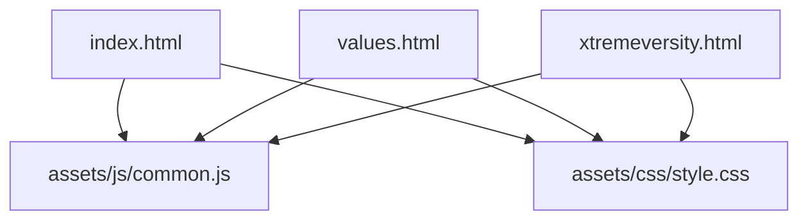
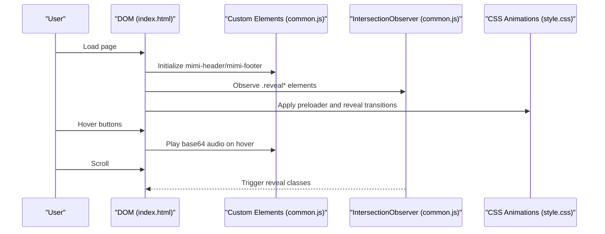
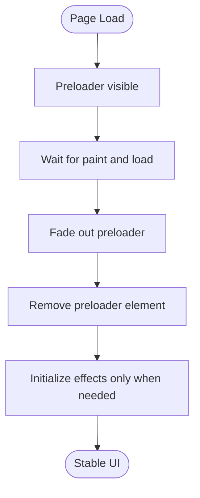
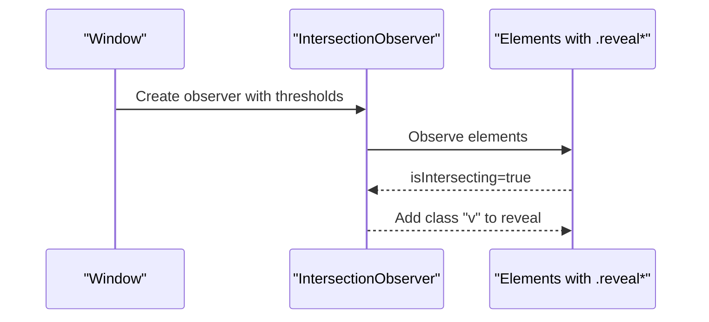
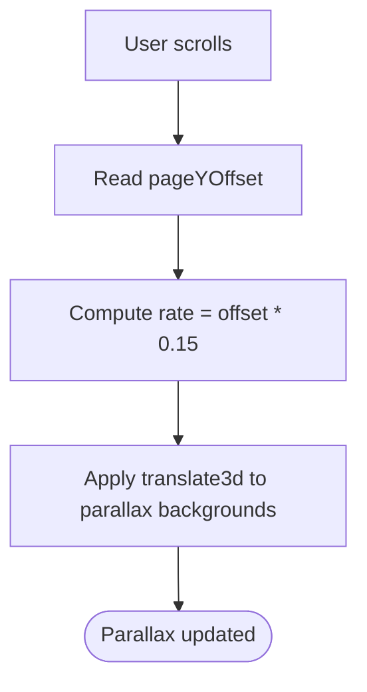
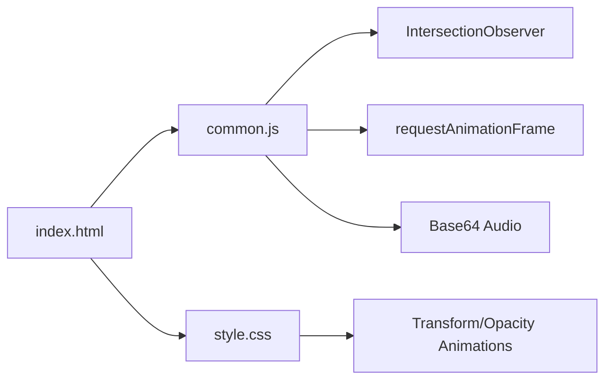

# Performance Optimization

<cite>
**Referenced Files in This Document**
- [index.html](file://index.html)
- [common.js](file://assets/js/common.js)
- [style.css](file://assets/css/style.css)
- [values.html](file://values.html)
- [xtremeversity.html](file://xtremeversity.html)
- [sitemap.xml](file://sitemap.xml)
- [robots.txt](file://robots.txt)
- [README.md](file://README.md)
</cite>

## Table of Contents
1. [Introduction](#introduction)
2. [Project Structure](#project-structure)
3. [Core Components](#core-components)
4. [Architecture Overview](#architecture-overview)
5. [Detailed Component Analysis](#detailed-component-analysis)
6. [Dependency Analysis](#dependency-analysis)
7. [Performance Considerations](#performance-considerations)
8. [Troubleshooting Guide](#troubleshooting-guide)
9. [Conclusion](#conclusion)
10. [Appendices](#appendices)

## Introduction
This document consolidates performance optimization strategies currently implemented in the Mimi Games website. It focuses on loading optimization (lazy loading patterns, base64-encoded audio for instant feedback), animation performance (hardware-accelerated CSS transforms, optimized JavaScript event handling), scroll monitoring (Intersection Observer), mobile performance (touch-friendly interactions, responsive images), metrics and monitoring, bundle size management, caching, and guidelines for maintaining performance during future enhancements.

## Project Structure
The site is a static single-page application with shared components and styles:
- Single entry page with interactive sections and animations
- Shared custom elements for header and footer
- Centralized CSS for animations, layout, and responsive behavior
- Sub-pages for values and game teaser with similar patterns

**Diagram sources**
- [index.html](file://index.html)
- [common.js](file://assets/js/common.js)
- [style.css](file://assets/css/style.css)
- [values.html](file://values.html)
- [xtremeversity.html](file://xtremeversity.html)

**Section sources**
- [README.md](file://README.md)
- [index.html](file://index.html)
- [values.html](file://values.html)
- [xtremeversity.html](file://xtremeversity.html)

## Core Components
- Custom Elements: Header and Footer are implemented as Web Components to reduce duplication and enable encapsulated behavior.
- Scroll Reveal: Intersection Observer is used to animate elements into view as they enter the viewport.
- Preloader: A lightweight preloader fades out after initial paint and resources load.
- Parallax: Scroll-driven parallax effect applied to a background element.
- 3D Card Tilt: Mousemove tilt effect for interactive cards, throttled by a width check.
- Canvas Particles: Lightweight particle system initialized on load.
- Base64 Audio: Embedded UI click sound for immediate feedback on hover.

**Section sources**
- [common.js](file://assets/js/common.js)
- [style.css](file://assets/css/style.css)
- [index.html](file://index.html)

## Architecture Overview
The runtime architecture centers on a small client-side script orchestrating UI interactions, animations, and scroll behaviors, backed by a shared stylesheet for responsive design and motion.

**Diagram sources**
- [index.html](file://index.html)
- [common.js](file://assets/js/common.js)
- [style.css](file://assets/css/style.css)

## Detailed Component Analysis

### Loading Optimization
- Preloader lifecycle: The preloader fades out after a short delay post-load and is removed after a total duration, ensuring perceived performance and preventing FOUC.
- Base64-encoded audio embedding: A compact MP3 is embedded as a data URI to eliminate network latency for UI hover feedback.
- Lazy pattern for heavy effects: 3D tilt effect initialization is deferred and gated by a minimum width, avoiding unnecessary work on small screens.

**Diagram sources**
- [common.js](file://assets/js/common.js)
- [style.css](file://assets/css/style.css)

**Section sources**
- [common.js](file://assets/js/common.js)
- [style.css](file://assets/css/style.css)

### Animation Performance Optimization
- Hardware-accelerated transforms: Animations rely on transform and opacity changes, which are GPU-accelerated. CSS keyframes and transitions are used for smoothness.
- Optimized JavaScript event handling: Scroll and mousemove handlers are scoped and conditionally executed. For example, tilt effect is only enabled on wider screens.
- Intersection Observer: Efficiently monitors element intersections to trigger reveal animations without continuous scroll polling.

**Diagram sources**
- [common.js](file://assets/js/common.js)

**Section sources**
- [common.js](file://assets/js/common.js)
- [style.css](file://assets/css/style.css)

### Scroll Monitoring and Interaction Patterns
- Scroll-driven parallax: A background element’s transform is updated on scroll events at a modest rate.
- Back-to-top button: Smooth scroll to top on click.
- Responsive interactions: Accordion headers toggle content on small screens; navigation collapses into a hamburger menu.

**Diagram sources**
- [common.js](file://assets/js/common.js)

**Section sources**
- [common.js](file://assets/js/common.js)
- [style.css](file://assets/css/style.css)

### Mobile Performance Considerations
- Touch-friendly interactions: Buttons and cards use hover and focus affordances appropriate for touch; hover-triggered audio is disabled on smaller screens.
- Responsive image handling: Images use object-fit and aspect ratios suitable for various viewports; sub-pages demonstrate consistent sizing.
- Battery usage optimization: Effects are gated by screen width and throttled by Intersection Observer and requestAnimationFrame usage.

**Section sources**
- [common.js](file://assets/js/common.js)
- [style.css](file://assets/css/style.css)
- [values.html](file://values.html)
- [xtremeversity.html](file://xtremeversity.html)

### Metrics Collection and Monitoring
- Current state: No explicit performance metrics collection is present in the codebase.
- Recommended approach: Integrate Performance Navigation Timing, Largest Contentful Paint, and Cumulative Layout Shift reporting. Use a lightweight beacon to send anonymized metrics to an analytics endpoint.

[No sources needed since this section provides general guidance]

### Bundle Size Management and Caching Optimization
- Bundle size: The site uses a single centralized JavaScript file and stylesheet, minimizing HTTP requests. Consider minification and compression for production hosting.
- Caching: Leverage long-lived cache headers for static assets and cache-busting filenames. Implement service workers for offline caching and pre-caching critical assets.

[No sources needed since this section provides general guidance]

## Dependency Analysis
The runtime depends on:
- Custom Elements for header/footer
- CSS for animations and responsive layout
- Intersection Observer for scroll-based reveals
- requestAnimationFrame for smooth canvas animation
- Data URIs for audio

**Diagram sources**
- [common.js](file://assets/js/common.js)
- [style.css](file://assets/css/style.css)
- [index.html](file://index.html)

**Section sources**
- [common.js](file://assets/js/common.js)
- [style.css](file://assets/css/style.css)
- [index.html](file://index.html)

## Performance Considerations
- Keep animations on the compositor thread: Prefer transform and opacity changes.
- Limit layout thrashing: Batch DOM reads/writes and avoid synchronous layout queries in loops.
- Optimize scroll handlers: Debounce or throttle where necessary; Intersection Observer is preferred for scroll-based triggers.
- Reduce main-thread work: Initialize heavy effects conditionally and defer where possible.
- Image optimization: Use appropriately sized images and modern formats; lazy-load offscreen images.
- Minimize repaint area: Scope transforms and shadows to necessary elements.

[No sources needed since this section provides general guidance]

## Troubleshooting Guide
- Preloader not removing: Verify load timing and removal delays; ensure no blocking resources prevent load events.
- Reveal animations not firing: Confirm Intersection Observer thresholds and root margins; ensure elements are within the viewport or near it.
- Tilt effect not working: Check screen width gating and initialization timing; confirm mousemove events are attached.
- Parallax lagging: Validate scroll handler frequency and transform usage; prefer translate3d and avoid layout-affecting properties.
- Base64 audio not playing: Ensure volume is set and play is invoked on user gesture; handle potential autoplay restrictions.

**Section sources**
- [common.js](file://assets/js/common.js)
- [style.css](file://assets/css/style.css)

## Conclusion
The Mimi Games website employs several proven performance strategies: a preloader for perceived performance, base64 audio for instant feedback, Intersection Observer for efficient scroll monitoring, hardware-accelerated CSS animations, and conditional initialization of heavier effects. To further strengthen performance, integrate metrics collection, adopt minification and compression, implement robust caching, and continue optimizing images and effects for mobile.

[No sources needed since this section summarizes without analyzing specific files]

## Appendices

### SEO and Indexability
- Sitemap and robots are present to aid indexing and crawlability.

**Section sources**
- [sitemap.xml](file://sitemap.xml)
- [robots.txt](file://robots.txt)