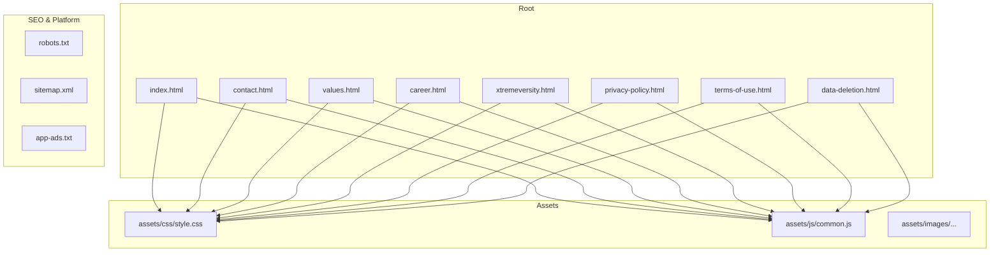
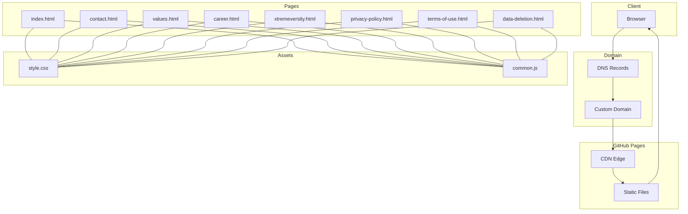
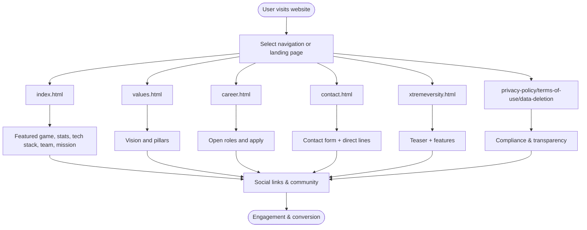
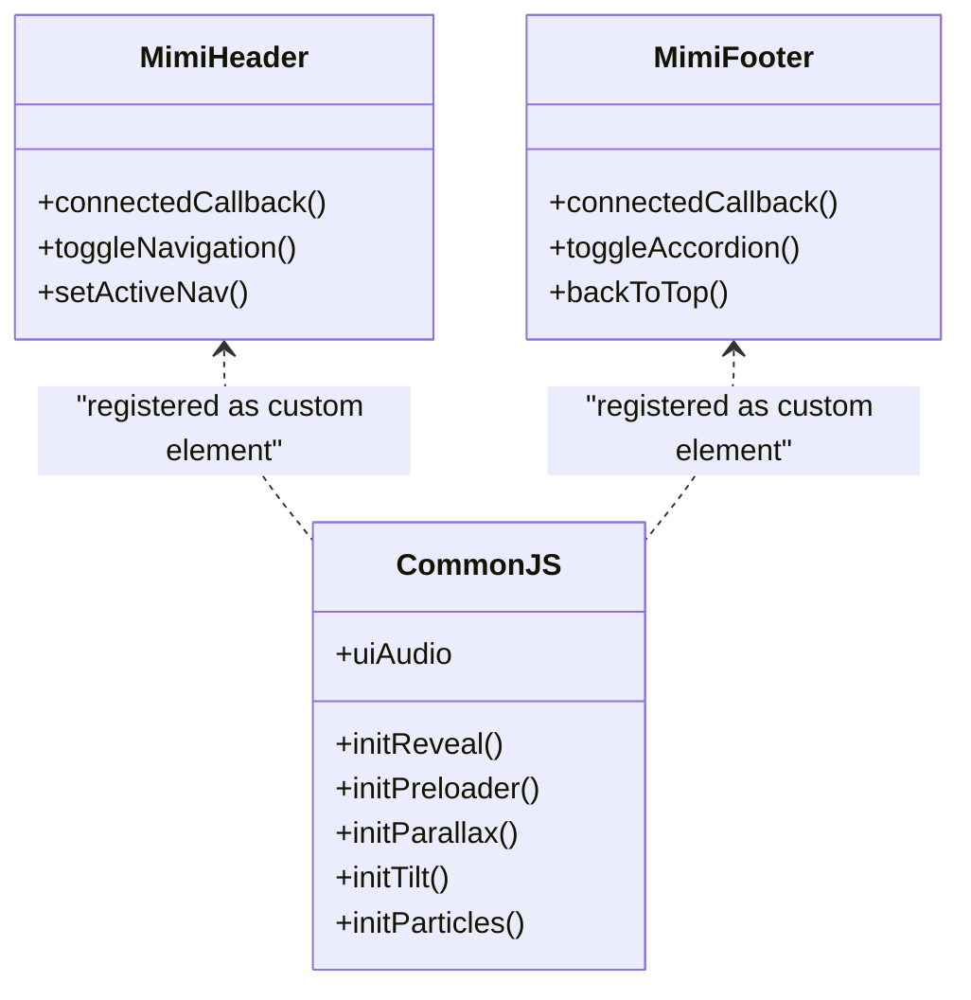
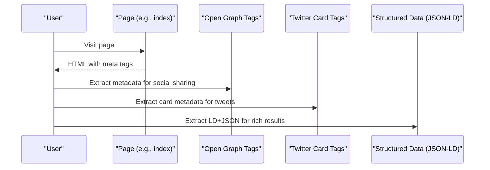
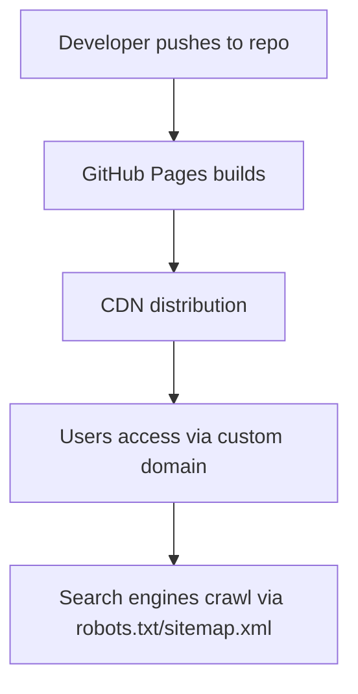
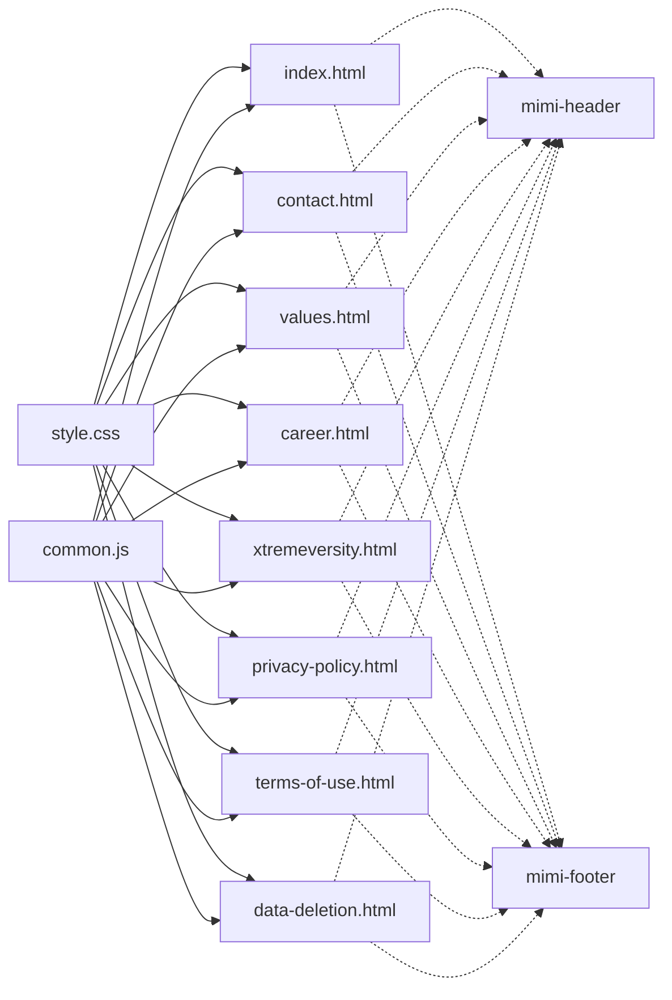

# Project Overview

<cite>
**Referenced Files in This Document**
- [README.md](file://README.md)
- [index.html](file://index.html)
- [contact.html](file://contact.html)
- [values.html](file://values.html)
- [career.html](file://career.html)
- [xtremeversity.html](file://xtremeversity.html)
- [privacy-policy.html](file://privacy-policy.html)
- [terms-of-use.html](file://terms-of-use.html)
- [data-deletion.html](file://data-deletion.html)
- [style.css](file://assets/css/style.css)
- [common.js](file://assets/js/common.js)
- [app-ads.txt](file://app-ads.txt)
- [robots.txt](file://robots.txt)
- [sitemap.xml](file://sitemap.xml)
</cite>

## Table of Contents
1. [Introduction](#introduction)
2. [Project Structure](#project-structure)
3. [Core Components](#core-components)
4. [Architecture Overview](#architecture-overview)
5. [Detailed Component Analysis](#detailed-component-analysis)
6. [Dependency Analysis](#dependency-analysis)
7. [Performance Considerations](#performance-considerations)
8. [Troubleshooting Guide](#troubleshooting-guide)
9. [Conclusion](#conclusion)
10. [Appendices](#appendices)

## Introduction
Mimi Games is a Pakistani mobile game studio focused on delivering high-quality, immersive Android games. The official website serves as the digital storefront for the studio’s portfolio, showcasing its games, company philosophy, team, and legal compliance. It is a static site hosted on GitHub Pages with a custom domain, emphasizing fast loading, SEO-friendly markup, and a cohesive brand experience across multiple HTML pages.

The website’s purpose is to:
- Present Mimi Games’ mobile gaming portfolio and brand identity
- Showcase featured games and upcoming titles
- Communicate company values, culture, and team
- Provide contact channels and career opportunities
- Ensure legal transparency with privacy, terms, and data deletion policies
- Integrate social media presence and discovery signals

Target audience:
- Players seeking free Android games
- Prospective employees and collaborators
- Partners and investors
- Regulatory and platform compliance stakeholders

## Project Structure
The project is organized as a static website with multiple HTML pages and shared assets:
- Root-level HTML pages for the homepage, company information, legal documents, and showcase pages
- Shared assets in assets/css and assets/js
- Supporting SEO and platform files (robots.txt, sitemap.xml, app-ads.txt)

**Diagram sources**
- [index.html:1-501](file://index.html#L1-L501)
- [contact.html:1-130](file://contact.html#L1-L130)
- [values.html:1-107](file://values.html#L1-L107)
- [career.html:1-100](file://career.html#L1-L100)
- [xtremeversity.html:1-91](file://xtremeversity.html#L1-L91)
- [privacy-policy.html:1-502](file://privacy-policy.html#L1-L502)
- [terms-of-use.html:1-104](file://terms-of-use.html#L1-L104)
- [data-deletion.html:1-173](file://data-deletion.html#L1-L173)
- [style.css:1-845](file://assets/css/style.css#L1-L845)
- [common.js:1-235](file://assets/js/common.js#L1-L235)
- [robots.txt:1-5](file://robots.txt#L1-L5)
- [sitemap.xml:1-52](file://sitemap.xml#L1-L52)
- [app-ads.txt:1-2](file://app-ads.txt#L1-L2)

**Section sources**
- [README.md:1-11](file://README.md#L1-L11)
- [index.html:1-501](file://index.html#L1-L501)
- [style.css:1-845](file://assets/css/style.css#L1-L845)
- [common.js:1-235](file://assets/js/common.js#L1-L235)
- [robots.txt:1-5](file://robots.txt#L1-L5)
- [sitemap.xml:1-52](file://sitemap.xml#L1-L52)
- [app-ads.txt:1-2](file://app-ads.txt#L1-L2)

## Core Components
- Static HTML pages: index, contact, values, career, xtremeversity, privacy-policy, terms-of-use, data-deletion
- Shared styles: assets/css/style.css
- Shared scripts: assets/js/common.js
- Discovery and compliance: robots.txt, sitemap.xml, app-ads.txt

Key responsibilities:
- index.html: Hero, stats, about, featured game, technologies, team, mission, teaser, community, final CTA
- values.html: Vision and pillars of the studio
- career.html: Open roles and application pathway
- xtremeversity.html: Teaser and features for the upcoming game
- privacy-policy.html, terms-of-use.html, data-deletion.html: Legal compliance and transparency
- style.css: Theming, responsive layout, animations, and reusable components
- common.js: Custom elements (header/footer), scroll reveal, preloader, parallax, tilt effects, particle canvas, UI sound

**Section sources**
- [index.html:1-501](file://index.html#L1-L501)
- [values.html:1-107](file://values.html#L1-L107)
- [career.html:1-100](file://career.html#L1-L100)
- [xtremeversity.html:1-91](file://xtremeversity.html#L1-L91)
- [privacy-policy.html:1-502](file://privacy-policy.html#L1-L502)
- [terms-of-use.html:1-104](file://terms-of-use.html#L1-L104)
- [data-deletion.html:1-173](file://data-deletion.html#L1-L173)
- [style.css:1-845](file://assets/css/style.css#L1-L845)
- [common.js:1-235](file://assets/js/common.js#L1-L235)

## Architecture Overview
The website follows a static site architecture with:
- Multiple HTML pages with shared header and footer via custom elements
- Centralized styling and behavior in shared assets
- GitHub Pages hosting with a custom domain
- Compliance artifacts for SEO and platform verification

**Diagram sources**
- [index.html:1-501](file://index.html#L1-L501)
- [contact.html:1-130](file://contact.html#L1-L130)
- [values.html:1-107](file://values.html#L1-L107)
- [career.html:1-100](file://career.html#L1-L100)
- [xtremeversity.html:1-91](file://xtremeversity.html#L1-L91)
- [privacy-policy.html:1-502](file://privacy-policy.html#L1-L502)
- [terms-of-use.html:1-104](file://terms-of-use.html#L1-L104)
- [data-deletion.html:1-173](file://data-deletion.html#L1-L173)
- [style.css:1-845](file://assets/css/style.css#L1-L845)
- [common.js:1-235](file://assets/js/common.js#L1-L235)
- [robots.txt:1-5](file://robots.txt#L1-L5)
- [sitemap.xml:1-52](file://sitemap.xml#L1-L52)
- [app-ads.txt:1-2](file://app-ads.txt#L1-L2)

## Detailed Component Analysis

### Static Site Pages and Scope
- Home page (index): Hero, ticker strip, stats, about, featured game (Rogue Wheel), technologies, team, mission, teaser (Xtremeversity), community, final CTA
- Company information: values (vision and pillars), career (roles and application)
- Game showcase: xtremeversity (teaser and features)
- Legal compliance: privacy-policy, terms-of-use, data-deletion
- Social integration: canonical URLs, Open Graph, Twitter Card, structured data (JSON-LD), social links in header/footer

**Section sources**
- [index.html:1-501](file://index.html#L1-L501)
- [values.html:1-107](file://values.html#L1-L107)
- [career.html:1-100](file://career.html#L1-L100)
- [contact.html:1-130](file://contact.html#L1-L130)
- [xtremeversity.html:1-91](file://xtremeversity.html#L1-L91)
- [privacy-policy.html:1-502](file://privacy-policy.html#L1-L502)
- [terms-of-use.html:1-104](file://terms-of-use.html#L1-L104)
- [data-deletion.html:1-173](file://data-deletion.html#L1-L173)

### Technology Stack and Implementation
- HTML5: Semantic structure, meta tags, structured data, forms
- CSS3: Variables, animations, responsive grids, glass morphism, custom scrollbar, media queries
- JavaScript ES6+: Custom elements (mimi-header, mimi-footer), IntersectionObserver for scroll reveal, canvas particle background, parallax, 3D tilt, preloader, UI sound

**Diagram sources**
- [common.js:1-235](file://assets/js/common.js#L1-L235)

**Section sources**
- [style.css:1-845](file://assets/css/style.css#L1-L845)
- [common.js:1-235](file://assets/js/common.js#L1-L235)

### SEO, Social, and Legal Signals
- Canonical URLs and structured data (JSON-LD) for organization and mobile application
- Open Graph and Twitter Card meta tags
- robots.txt and sitemap.xml for search engine discovery
- app-ads.txt for AdMob verification
- Privacy, Terms, and Data Deletion pages for compliance

**Diagram sources**
- [index.html:25-74](file://index.html#L25-L74)
- [privacy-policy.html:1-502](file://privacy-policy.html#L1-L502)
- [terms-of-use.html:1-104](file://terms-of-use.html#L1-L104)
- [data-deletion.html:1-173](file://data-deletion.html#L1-L173)
- [sitemap.xml:1-52](file://sitemap.xml#L1-L52)
- [robots.txt:1-5](file://robots.txt#L1-L5)
- [app-ads.txt:1-2](file://app-ads.txt#L1-L2)

**Section sources**
- [index.html:1-501](file://index.html#L1-L501)
- [sitemap.xml:1-52](file://sitemap.xml#L1-L52)
- [robots.txt:1-5](file://robots.txt#L1-L5)
- [app-ads.txt:1-2](file://app-ads.txt#L1-L2)

### Hosting and Domain Setup
- Hosted via GitHub Pages with a custom domain
- robots.txt enables crawling and points to sitemap.xml
- sitemap.xml enumerates core pages with priorities and change frequencies

**Section sources**
- [README.md:10-10](file://README.md#L10-L10)
- [robots.txt:1-5](file://robots.txt#L1-L5)
- [sitemap.xml:1-52](file://sitemap.xml#L1-L52)

## Dependency Analysis
- Pages depend on shared CSS and JS assets
- Header and footer are injected via custom elements, reducing duplication
- Legal pages depend on canonical URLs and structured data for platform compliance
- SEO artifacts (robots.txt, sitemap.xml, app-ads.txt) are independent but coordinated

**Diagram sources**
- [index.html:1-501](file://index.html#L1-L501)
- [contact.html:1-130](file://contact.html#L1-L130)
- [values.html:1-107](file://values.html#L1-L107)
- [career.html:1-100](file://career.html#L1-L100)
- [xtremeversity.html:1-91](file://xtremeversity.html#L1-L91)
- [privacy-policy.html:1-502](file://privacy-policy.html#L1-L502)
- [terms-of-use.html:1-104](file://terms-of-use.html#L1-L104)
- [data-deletion.html:1-173](file://data-deletion.html#L1-L173)
- [style.css:1-845](file://assets/css/style.css#L1-L845)
- [common.js:1-235](file://assets/js/common.js#L1-L235)

**Section sources**
- [style.css:1-845](file://assets/css/style.css#L1-L845)
- [common.js:1-235](file://assets/js/common.js#L1-L235)

## Performance Considerations
- Static delivery via GitHub Pages and CDN minimizes latency
- Shared assets reduce bandwidth and improve caching
- CSS variables and minimal DOM manipulation optimize rendering
- IntersectionObserver-based scroll reveal reduces layout thrashing
- Canvas particle background is initialized only when present
- Preloader and lazy initialization of heavier effects (tilt, parallax) improve perceived performance

[No sources needed since this section provides general guidance]

## Troubleshooting Guide
Common areas to verify:
- Navigation: Ensure nav links match filenames and active state logic
- Forms: Validate form action endpoint and required attributes
- Assets: Confirm asset paths resolve correctly across pages
- SEO: Verify canonical URLs, meta descriptions, and structured data
- Legal pages: Confirm effective dates and links to external policies
- Social links: Ensure icons and targets are correct in header/footer

**Section sources**
- [common.js:1-235](file://assets/js/common.js#L1-L235)
- [index.html:1-501](file://index.html#L1-L501)
- [contact.html:1-130](file://contact.html#L1-L130)
- [privacy-policy.html:1-502](file://privacy-policy.html#L1-L502)
- [terms-of-use.html:1-104](file://terms-of-use.html#L1-L104)
- [data-deletion.html:1-173](file://data-deletion.html#L1-L173)

## Conclusion
Mimi Games’ official website is a purpose-built static storefront that communicates the studio’s identity, portfolio, and values while maintaining legal transparency and platform compliance. Its modular structure, shared assets, and custom elements enable consistent branding and performance across multiple pages. With GitHub Pages hosting and a custom domain, the site delivers a reliable, fast, and SEO-friendly experience for players, partners, and stakeholders.

[No sources needed since this section summarizes without analyzing specific files]

## Appendices
- Additional resources: robots.txt, sitemap.xml, app-ads.txt
- Notes: The site emphasizes free-to-play Android games, ethical design, and performance across device tiers.

**Section sources**
- [robots.txt:1-5](file://robots.txt#L1-L5)
- [sitemap.xml:1-52](file://sitemap.xml#L1-L52)
- [app-ads.txt:1-2](file://app-ads.txt#L1-L2)