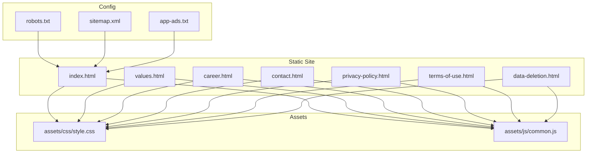
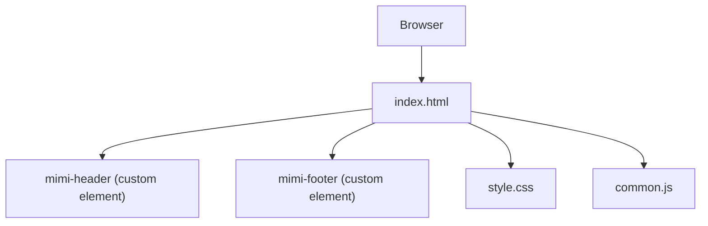
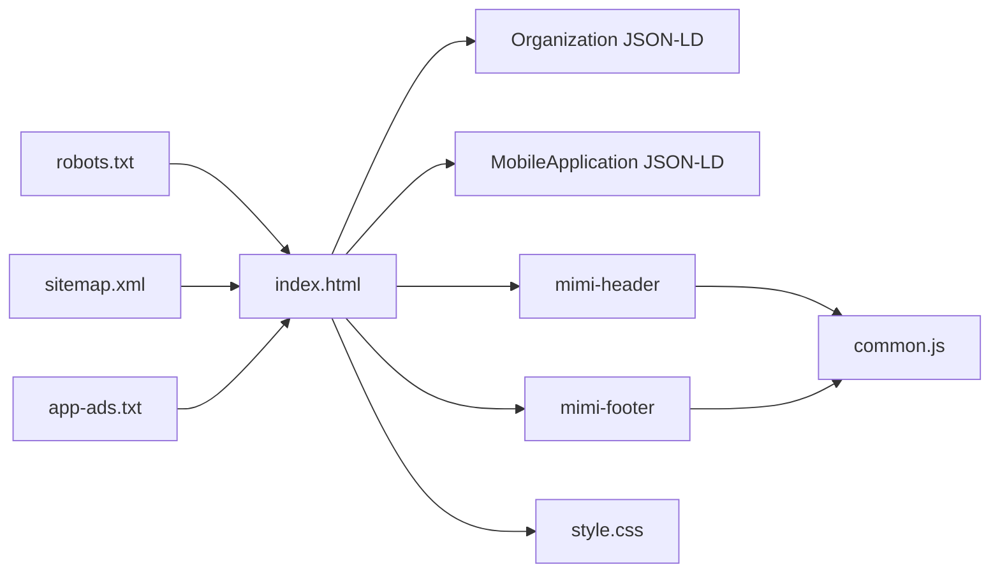

# SEO and Accessibility

<cite>
**Referenced Files in This Document**
- [index.html](file://index.html)
- [values.html](file://values.html)
- [career.html](file://career.html)
- [contact.html](file://contact.html)
- [privacy-policy.html](file://privacy-policy.html)
- [terms-of-use.html](file://terms-of-use.html)
- [data-deletion.html](file://data-deletion.html)
- [robots.txt](file://robots.txt)
- [sitemap.xml](file://sitemap.xml)
- [app-ads.txt](file://app-ads.txt)
- [style.css](file://assets/css/style.css)
- [common.js](file://assets/js/common.js)
- [README.md](file://README.md)
</cite>

## Table of Contents
1. [Introduction](#introduction)
2. [Project Structure](#project-structure)
3. [Core Components](#core-components)
4. [Architecture Overview](#architecture-overview)
5. [Detailed Component Analysis](#detailed-component-analysis)
6. [Dependency Analysis](#dependency-analysis)
7. [Performance Considerations](#performance-considerations)
8. [Troubleshooting Guide](#troubleshooting-guide)
9. [Conclusion](#conclusion)
10. [Appendices](#appendices)

## Introduction
This document explains how the Mimi Games website implements SEO and accessibility across its static pages. It covers structured data (JSON-LD), meta tag management (title, description, Open Graph), accessibility features (ARIA, keyboard navigation, semantic structure), robots.txt and sitemap.xml configuration, app-ads.txt for AdMob verification, cross-browser compatibility considerations, and performance impacts on SEO. It also provides practical guidelines for maintaining SEO best practices during content updates and adding new pages.

## Project Structure
The website is a static site hosted on GitHub Pages with a custom domain. It includes:
- A homepage with rich structured data and social metadata
- Legal and informational pages (values, careers, contact, privacy, terms, data deletion)
- Global assets (CSS and JavaScript) shared across pages
- Configuration files for search engine crawling and advertising verification

**Diagram sources**
- [index.html](file://index.html)
- [values.html](file://values.html)
- [career.html](file://career.html)
- [contact.html](file://contact.html)
- [privacy-policy.html](file://privacy-policy.html)
- [terms-of-use.html](file://terms-of-use.html)
- [data-deletion.html](file://data-deletion.html)
- [style.css](file://assets/css/style.css)
- [common.js](file://assets/js/common.js)
- [robots.txt](file://robots.txt)
- [sitemap.xml](file://sitemap.xml)
- [app-ads.txt](file://app-ads.txt)

**Section sources**
- [README.md](file://README.md)

## Core Components
- Structured data (JSON-LD): Organization and MobileApplication schemas enable rich results and app cards in Google search.
- Meta tags: Title, description, canonical, Open Graph, Twitter card, and author/keywords.
- Accessibility: ARIA labels, semantic HTML, keyboard navigation, and focus management.
- Crawling and indexing: robots.txt and sitemap.xml.
- Advertising verification: app-ads.txt for AdMob.
- Assets: CSS and JavaScript that support UI interactions and responsive behavior.

**Section sources**
- [index.html](file://index.html)
- [robots.txt](file://robots.txt)
- [sitemap.xml](file://sitemap.xml)
- [app-ads.txt](file://app-ads.txt)
- [style.css](file://assets/css/style.css)
- [common.js](file://assets/js/common.js)

## Architecture Overview
The site is composed of independent HTML pages that share a common theme and assets. Each page sets its own meta tags and canonical URL. The homepage includes JSON-LD for organization and app information. Navigation and footer are implemented as custom elements loaded via JavaScript. Robots and sitemap files guide search engine crawlers.

**Diagram sources**
- [index.html](file://index.html)
- [common.js](file://assets/js/common.js)
- [style.css](file://assets/css/style.css)

## Detailed Component Analysis

### Structured Data (JSON-LD)
The homepage defines two JSON-LD blocks:
- Organization schema: Provides brand identity, address, and social profiles for enhanced search presence.
- MobileApplication schema: Describes the featured game with category, genre, offers, author, image, and keywords to enable rich results and app cards.

Implementation highlights:
- Context and types are set to schema.org.
- Canonical URLs are used consistently across pages.
- Image URLs and app download links are included for rich results.

Best practices:
- Keep schema fields aligned with page content.
- Update last-modified dates in sitemap.xml when schema content changes.
- Validate with Google Rich Results Test.

**Section sources**
- [index.html](file://index.html)
- [sitemap.xml](file://sitemap.xml)

### Meta Tag Management
Each page sets:
- Title and description for SEO and social previews.
- Canonical URL to prevent duplicate content issues.
- Open Graph properties (og:title, og:description, og:image, og:url, og:type).
- Twitter card meta (twitter:card, twitter:title, twitter:description).
- Author and keywords for contextual signals.

Guidelines:
- Keep titles concise and unique per page.
- Write descriptions that summarize the page’s purpose.
- Use absolute URLs for og:image and og:url.
- Ensure og:type matches the content (website for landing pages).

**Section sources**
- [index.html](file://index.html)
- [values.html](file://values.html)
- [career.html](file://career.html)
- [contact.html](file://contact.html)
- [privacy-policy.html](file://privacy-policy.html)
- [terms-of-use.html](file://terms-of-use.html)
- [data-deletion.html](file://data-deletion.html)

### Accessibility Features
The site incorporates several accessibility mechanisms:
- ARIA labels: The navigation toggle button includes aria-label for screen readers.
- Semantic HTML: Headings, lists, and landmarks are used appropriately.
- Keyboard navigation: Focus styles and tab order are preserved by CSS and JavaScript.
- Custom elements: mimi-header and mimi-footer encapsulate accessible navigation and footer markup.
- Focus management: JavaScript toggles active states and manages focus on interactive elements.

Recommendations:
- Add aria-expanded to the navigation toggle to reflect state.
- Ensure skip links for keyboard-only users.
- Provide visible focus indicators and avoid hiding focus styles.
- Use role attributes where custom widgets are present.

**Section sources**
- [common.js](file://assets/js/common.js)
- [style.css](file://assets/css/style.css)

### Robots.txt and Sitemap.xml
- robots.txt allows crawling and directs crawlers to sitemap.xml.
- sitemap.xml lists all pages with lastmod, changefreq, and priority to guide indexing.

Guidelines:
- Keep sitemap updated when adding/removing pages.
- Use accurate lastmod timestamps.
- Avoid disallowing crawlable public pages.

**Section sources**
- [robots.txt](file://robots.txt)
- [sitemap.xml](file://sitemap.xml)

### app-ads.txt Implementation
The file includes the AdMob verification entry for publisher ID and configuration. This helps establish trust with Google and prevents unauthorized ad networks from serving on the site.

**Section sources**
- [app-ads.txt](file://app-ads.txt)

### Cross-Browser Compatibility and Performance Impact on SEO
Observations:
- CSS uses modern features (e.g., backdrop-filter, CSS variables) that may not render identically across older browsers. Ensure graceful degradation.
- JavaScript enables custom elements and dynamic interactions. Verify fallback behavior when JavaScript is disabled.
- Preloader and lazy loading of images reduce perceived load time.
- Canonical and structured data improve SEO regardless of browser differences.

Recommendations:
- Test on major browsers and provide basic functionality without JavaScript.
- Minimize layout shifts and ensure images have explicit dimensions.
- Monitor Core Web Vitals to maintain SEO health.

**Section sources**
- [style.css](file://assets/css/style.css)
- [common.js](file://assets/js/common.js)
- [index.html](file://index.html)

## Dependency Analysis
The pages depend on shared assets and configuration. The homepage depends on structured data and social metadata. Navigation and footer are injected via custom elements, reducing duplication.

**Diagram sources**
- [index.html](file://index.html)
- [common.js](file://assets/js/common.js)
- [style.css](file://assets/css/style.css)
- [robots.txt](file://robots.txt)
- [sitemap.xml](file://sitemap.xml)
- [app-ads.txt](file://app-ads.txt)

**Section sources**
- [index.html](file://index.html)
- [common.js](file://assets/js/common.js)
- [style.css](file://assets/css/style.css)
- [robots.txt](file://robots.txt)
- [sitemap.xml](file://sitemap.xml)
- [app-ads.txt](file://app-ads.txt)

## Performance Considerations
- Minimize render-blocking resources: The CSS is linked externally; ensure it loads efficiently.
- Lazy-load images and defer non-critical scripts.
- Use responsive images and appropriate sizes.
- Keep page weight low to improve Core Web Vitals and search rankings.
- Monitor Largest Contentful Paint (LCP), First Input Delay (FID), and Cumulative Layout Shift (CLS).

[No sources needed since this section provides general guidance]

## Troubleshooting Guide
Common issues and resolutions:
- Missing or incorrect canonical URL: Ensure each page sets a canonical pointing to itself.
- Broken Open Graph images: Verify absolute URLs and image accessibility.
- Structured data errors: Validate with Google Rich Results Test and fix schema mismatches.
- Navigation not accessible: Confirm aria-label and aria-expanded are present and correct.
- Sitemap not indexed: Confirm robots.txt allows crawling and sitemap URL is correct.

**Section sources**
- [index.html](file://index.html)
- [robots.txt](file://robots.txt)
- [sitemap.xml](file://sitemap.xml)
- [common.js](file://assets/js/common.js)

## Conclusion
The Mimi Games website implements essential SEO and accessibility practices: structured data for rich results, comprehensive meta tags for search and social previews, accessible navigation and custom elements, and robust crawling configuration via robots.txt and sitemap.xml. The app-ads.txt file supports AdMob verification. Following the guidelines in this document will help maintain strong SEO performance and accessibility as the site evolves.

[No sources needed since this section summarizes without analyzing specific files]

## Appendices

### Guidelines for Maintaining SEO Best Practices
- Title and description: Keep unique and descriptive for each page.
- Canonicalization: Always set canonical to the live URL.
- Images: Provide alt attributes and compress images.
- Internal linking: Link to related pages to improve topical authority.
- Schema updates: Align JSON-LD with page content and update sitemap lastmod.
- New pages: Add to sitemap.xml with appropriate priority and changefreq.
- Testing: Validate structured data and check crawlability with robots.txt.

**Section sources**
- [sitemap.xml](file://sitemap.xml)
- [index.html](file://index.html)