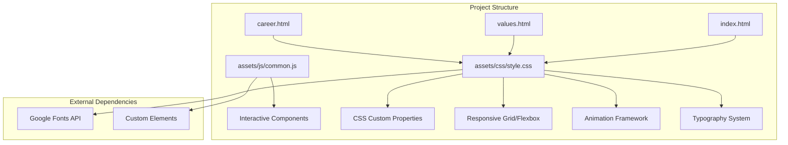
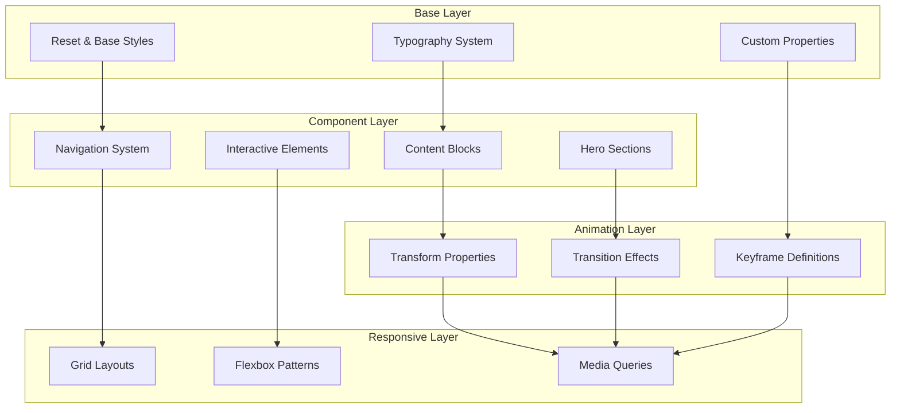
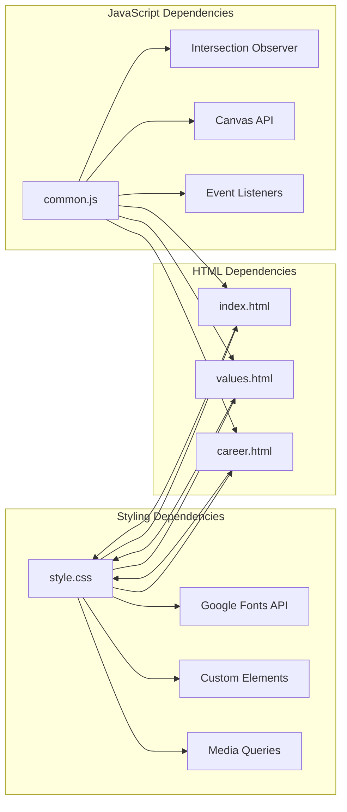

# Styling Architecture

<cite>
**Referenced Files in This Document**
- [style.css](file://assets/css/style.css)
- [index.html](file://index.html)
- [common.js](file://assets/js/common.js)
- [values.html](file://values.html)
- [career.html](file://career.html)
- [README.md](file://README.md)
</cite>

## Table of Contents
1. [Introduction](#introduction)
2. [Project Structure](#project-structure)
3. [Core Components](#core-components)
4. [Architecture Overview](#architecture-overview)
5. [Detailed Component Analysis](#detailed-component-analysis)
6. [Dependency Analysis](#dependency-analysis)
7. [Performance Considerations](#performance-considerations)
8. [Troubleshooting Guide](#troubleshooting-guide)
9. [Conclusion](#conclusion)

## Introduction

The Mimi Games website employs a sophisticated CSS architecture built around modern design principles and performance optimization. This styling system combines CSS custom properties for theming, advanced animation frameworks, and responsive design patterns to create a premium gaming experience across all devices.

The architecture emphasizes modularity, maintainability, and scalability while delivering visually stunning animations and transitions that reflect the gaming industry aesthetic. The system integrates seamlessly with JavaScript for interactive components and maintains consistency across all pages through shared design tokens.

## Project Structure

The styling architecture follows a clean, modular approach with centralized CSS organization and minimal JavaScript integration for enhanced performance.

**Diagram sources**
- [style.css:1-16](file://assets/css/style.css#L1-L16)
- [index.html:9](file://index.html#L9)
- [common.js:1-51](file://assets/js/common.js#L1-L51)

**Section sources**
- [README.md:1-11](file://README.md#L1-L11)
- [style.css:16](file://assets/css/style.css#L16)

## Core Components

### CSS Custom Properties System

The foundation of the styling architecture lies in a comprehensive custom properties system that provides consistent theming across all components.

**Color Palette Variables:**
- Primary: `--orange` (#e87c2a) - Flame primary color
- Secondary: `--teal` (#5cc8c8) - Character secondary color  
- Background: `--void` (#0a0810) - Dark purple-black base
- Surface: `--night` (#12101a) - Section surfaces
- Text: `--cream` (#f5e0c8) - Headings and primary text
- Muted: `--muted` (#7a6e64) - Body text
- Glass: `--glass` (rgba) - Transparent glass effect

**Spacing Scale Variables:**
- Base: `--r` (16px) - Primary spacing unit
- Secondary: `--r2` (24px) - Secondary spacing unit
- Glows: `--glow-o` and `--glow-t` - Color-specific glow effects

**Section sources**
- [style.css:20-42](file://assets/css/style.css#L20-L42)

### Typography System

The typography system utilizes Google Fonts integration with a dual-font approach:

**Primary Fonts:**
- Barlow Condensed: Used for headings and brand elements
- Inter: Used for body text and interface elements

**Font Hierarchy:**
- H1: clamp(3rem, 8vw, 7rem) - Responsive hero headings
- H2: clamp(2rem, 4vw, 3.2rem) - Section headings
- H3: 1.3rem - Subheadings with 1.5px letter spacing
- Body: 1rem - Standard paragraph text
- Labels: 0.72rem - Uppercased labels with 4px letter spacing

**Section sources**
- [style.css:16](file://assets/css/style.css#L16)
- [style.css:73-83](file://assets/css/style.css#L73-L83)

### Animation Framework

The animation system provides a comprehensive set of keyframes and transition effects:

**Core Keyframes:**
- `fadeUp`: Vertical entrance with opacity transition
- `fadeIn`: Simple fade in/out effects
- `shimmer`: Gradient text animation
- `pulse`: Pulsing scale and opacity effects
- `float`: Vertical floating motion
- `orbDrift1/2`: Orb movement animations
- `spinRight/Left`: Continuous rotation effects
- `ticker`: Horizontal scrolling marquee
- `countUp`: Numeric counter animation

**Transition Effects:**
- Consistent 0.25s-0.75s transition durations
- Cubic-bezier timing functions for natural motion
- Transform-based animations for GPU acceleration
- Backdrop-filter blur effects for glass morphism

**Section sources**
- [style.css:95-104](file://assets/css/style.css#L95-L104)
- [style.css:365-374](file://assets/css/style.css#L365-L374)

## Architecture Overview

The styling architecture follows a component-based approach with clear separation of concerns and modular organization.

**Diagram sources**
- [style.css:18](file://assets/css/style.css#L18)
- [style.css:20](file://assets/css/style.css#L20)
- [style.css:72](file://assets/css/style.css#L72)

## Detailed Component Analysis

### Navigation System

The navigation system implements a hybrid approach combining traditional navigation with modern glass morphism effects.

**Desktop Navigation:**
- Sticky positioning with backdrop blur
- Hover effects with gradient backgrounds
- Active state highlighting with orange accents
- Smooth transitions for all interactive states

**Mobile Navigation:**
- Collapsible hamburger menu
- Slide-down animation with backdrop blur
- Accordion-style footer navigation
- Responsive breakpoint at 900px

**Section sources**
- [style.css:172-217](file://assets/css/style.css#L172-L217)
- [style.css:762-780](file://assets/css/style.css#L762-L780)

### Hero Section Architecture

The hero section demonstrates advanced animation and layout techniques:

**Background Effects:**
- Radial gradient overlays with animated drift
- Floating orb decorations with blur filters
- Particle canvas background for dynamic motion
- HUD ring concentric circles with continuous rotation

**Content Layout:**
- Centered alignment with z-index management
- Animated entrance sequences with staggered delays
- SEO-friendly badge with gradient text effects
- Call-to-action buttons with hover transformations

**Section sources**
- [style.css:219-295](file://assets/css/style.css#L219-L295)
- [style.css:297-374](file://assets/css/style.css#L297-L374)

### Content Grid System

The content architecture utilizes CSS Grid for responsive layouts:

**Two-Column Layout:**
- Flexible grid with 6rem gap
- Reverse direction support for alternating layouts
- Align-items: start for consistent vertical alignment
- Responsive adjustments for mobile devices

**Glass Card System:**
- Auto-fit grid with minmax constraints
- Backdrop blur with 16px blur radius
- Hover effects with transform and shadow transitions
- Border accent indicators with gradient backgrounds

**Section sources**
- [style.css:453-457](file://assets/css/style.css#L453-L457)
- [style.css:513-547](file://assets/css/style.css#L513-L547)

### Interactive Components

JavaScript integration enhances the styling system with dynamic behaviors:

**Scroll Reveal:**
- Intersection Observer API for performance
- Threshold-based activation at 8%
- Root margin for delayed activation
- CSS class toggling for smooth transitions

**Parallax Effects:**
- Scroll event listener with transform3d
- Rate-based calculation for smooth motion
- Hardware acceleration through transform
- Element-specific targeting

**3D Tilt Effects:**
- Perspective-based transforms
- Mouse move event handling
- Center-based rotation calculations
- Scale3d for depth enhancement

**Section sources**
- [common.js:131-141](file://assets/js/common.js#L131-L141)
- [common.js:154-163](file://assets/js/common.js#L154-L163)
- [common.js:165-185](file://assets/js/common.js#L165-L185)

## Dependency Analysis

The styling architecture maintains loose coupling between components while ensuring consistent theming and behavior.

**Diagram sources**
- [style.css:16](file://assets/css/style.css#L16)
- [index.html:9](file://index.html#L9)
- [common.js:131-141](file://assets/js/common.js#L131-L141)

**Section sources**
- [style.css:16](file://assets/css/style.css#L16)
- [common.js:1-51](file://assets/js/common.js#L1-L51)

## Performance Considerations

The styling architecture prioritizes performance through several optimization strategies:

**Hardware Acceleration:**
- Transform-based animations instead of layout-affecting properties
- Backdrop-filter with hardware acceleration support
- 3D transforms using translate3d and perspective

**Efficient Animations:**
- GPU-accelerated transforms and opacity changes
- Optimized easing functions with cubic-bezier curves
- Reduced repaint areas through strategic z-index management

**Memory Management:**
- Intersection Observer for scroll-based animations
- Event delegation for interactive elements
- Minimal DOM manipulation through CSS classes

**Loading Optimization:**
- External font loading via Google Fonts API
- Lazy loading for non-critical animations
- Efficient media query breakpoints

## Troubleshooting Guide

Common styling issues and their solutions:

**Animation Performance Issues:**
- Verify transform properties are used instead of layout-affecting CSS
- Check for excessive repaints in hover states
- Ensure hardware acceleration is enabled for 3D transforms

**Responsive Layout Problems:**
- Validate media query breakpoints at 600px, 768px, and 900px
- Test grid-template-columns with repeat(auto-fit, minmax())
- Verify container queries for component isolation

**Custom Property Scope Issues:**
- Ensure variables are defined in :root scope
- Check for variable precedence in component-specific overrides
- Validate fallback values for unsupported browsers

**Font Loading Issues:**
- Verify Google Fonts API connectivity
- Check font-display property for optimal loading
- Implement font fallback strategies

**Section sources**
- [style.css:748-797](file://assets/css/style.css#L748-L797)
- [common.js:131-141](file://assets/js/common.js#L131-L141)

## Conclusion

The Mimi Games styling architecture represents a mature approach to modern CSS development, combining traditional design principles with cutting-edge animation techniques. The system successfully balances visual impact with performance optimization while maintaining code maintainability and scalability.

Key strengths include the comprehensive custom properties system, sophisticated animation framework, and responsive design patterns that adapt seamlessly across device sizes. The integration of JavaScript for interactive components enhances the user experience without compromising performance.

The architecture provides a solid foundation for future enhancements while maintaining consistency and brand identity across all pages. The modular approach ensures that new components can be added efficiently while preserving the established design language.